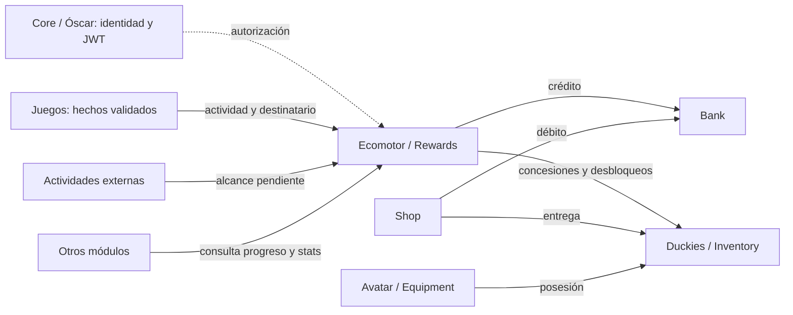

# Arquitectura candidata V2 · Equipo 5 y Rewards v0

## 1. Estado y fuentes

Consolidación documental de los acuerdos internos del 08/10/2026 y las novedades
del 09/10. **Rewards v0 es una propuesta técnica aceptada provisionalmente como
base de trabajo, pendiente de validación conjunta.** No hay aprobación global
de Óscar, Core, B/C o juegos del ERD V2 ni de los contratos.

| Fuente | Procedencia y autoridad |
| --- | --- |
| `DAR3_ (1).pdf`, §§9–10, pp. 48–53 | Consulta directa del alcance general, servicio común de recompensas y mínimo de intercambio. DAR3 no asigna individualmente A/B/C. |
| `11201_PR07_proyecto Ducky Arenas.pdf`, pp. 4–5, 10–11 y 17 | Consulta directa de proceso/evaluación: diseño antes del ORM, cardinalidades, borrado, permisos, tests y evidencias Git. Persiste el conflicto User/auth bajo D-17. |
| `DuckyEcomotor.pdf`, pp. 1–7 | Consulta directa: gestor central, reglas configurables, Bank/Shop, siete etapas y especializaciones en Actual. Su XP externa entra en tensión con la rectificación verbal del 09/10. |
| `DAR_formulas.pdf`, pp. 7–12 y 18 | Consulta directa de cálculo de acciones, consolidación, REST/WebSockets y ejemplo de stats; no se adoptan automáticamente fórmulas, código u ORM. |
| `DAR_DuckyClash.pdf`, p. 8; `DuckyTraining.pdf`, p. 1; `DuckyEscape.pdf`, pp. 1–2 | Consulta directa de tabla de stats por rol, repetibilidad/límite diario y premios parciales/finales. El Escape local no se identifica como la nueva versión consolidada mencionada en la reunión. |
| Dailys del 06, 07, 08 y 09/10/2026 | Notas y conclusiones: aclaraciones del profesor, propuestas de participantes y asuntos pendientes; no aprobación global de modelos o contratos. |
| Acuerdos internos comunicados del 08/10 | Reparto y organización objetivo registrados en D-20/D-21; no se infieren de comentarios de la reunión. |
| [Decisiones](decisions.md), [ERD](erd/ecomotor.md) y [Rewards v0](contracts/rewards-v0.md) | Se distinguen decisiones D vigentes, aceptación interna condicionada de Parte A y contrato candidato. |

DAR3 es la fuente principal de requisitos y responsabilidades. PR07 es guía de
desarrollo, metodología, evidencias y evaluación: en la daily del 06/10/2026 se
aclaró que su plan diario era una guía, no un calendario literal obligatorio.
Los PDFs posteriores amplían o precisan especificaciones; las aclaraciones
explícitas de las dailys pueden rectificarlas. Ante contradicción se documenta
el conflicto antes de fijar una interpretación. La documentación del repositorio
no constituye aprobación del profesor. Las cantidades ilustrativas no son
valores oficiales.

Se distinguen requisitos documentales, aclaraciones/rectificaciones del profesor,
propuestas de participantes, acuerdos internos, propuestas técnicas candidatas
no aceptadas conjuntamente y decisiones pendientes de validación.

## 2. Decisiones vigentes y organización objetivo

D-20 fija Jaime/A, Henry/B y Fernando/C. D-21 acuerda cuatro apps de dominio,
conservando `apps.users`. D-13 permanece como propuesta histórica de otro reparto;
D-14…D-16 no quedan confirmadas automáticamente.

En la mini daily del 06/10/2026 se propuso la organización de apps y quedó
pendiente de revisión. En la daily del 08/10/2026 Óscar indicó una revisión
por encima del documento y que faltaba examinarlo con más detalle. D-20/D-21
son acuerdos internos para organizar trabajo: límites de apps y contratos
requieren validación de Óscar/Core, Henry, Fernando y equipos consumidores.

La estructura implementada en el `develop` examinado sigue siendo el bootstrap:
`config/`, `apps.ecomotor` y `apps.users`, con perfiles iniciales sin campos de
negocio. D-21 es organización objetivo, no evidencia de apps nuevas creadas.
D-18 conserva las rutas/labels existentes y D-11 la ubicación de los perfiles.
La presente consolidación no mueve modelos ni valida la rama de Fernando.

D-05/D-09/D-10/D-17 conservan User estándar y ausencia de autenticación local.
Se utiliza `settings.AUTH_USER_MODEL`. **Óscar es el interlocutor de Core/Equipo 0**
para User, autenticación, JWT, integración y conservación; no se da por resuelto
el conflicto de PR07 ni se atribuye una política de borrado a ejemplos del PDF.

| Área / app objetivo | Responsable interno | Autoridad y límite |
| --- | --- | --- |
| Parte A · `apps.ecomotor` | Jaime | XP histórica, nivel, etapas, evolución, especializaciones, stats/puntos e historiales. Coordina Rewards y reglas; solicita efectos a sus propietarios. |
| Rewards · capacidad de Ecomotor | Jaime, con revisión A/B/C | Entrada lógica de hechos recompensables, evaluación, deduplicación y trazabilidad completas; no exige otra app. |
| Parte B · `apps.duckies` | Henry | Duckies, identidad de objetos, posesión, cantidades, concesiones, consumos, avatar, compatibilidad y equipamiento. Inventory y Equipment son capacidades de Duckies. |
| Parte C · `apps.bank` | Fernando | Única fuente de verdad de wallet, saldo y movimientos auditables de Duki Coins. Créditos, débitos y reservas si se incluyen apuestas. |
| Parte C · `apps.shop` | Fernando | Catálogo comercial, precios, disponibilidad y compras; coordina cargo con Bank y entrega con Duckies. |
| `apps.users` / integración Core | Equipo 5 con Óscar/Core | Perfiles actuales; identidad global, autenticación y JWT pertenecen a Core. |
| Juegos y otros emisores | Sus equipos | Validan hechos/resultados en su dominio; no son autoridad sobre XP, monedas o stats canónicos. |

El catálogo comercial de Shop se distingue de la identidad/posesión de objetos de
Duckies. Cada servicio escribe su estado; la coordinación no autoriza escrituras
directas en modelos de otra parte.

## 3. Requisitos funcionales y límites de V2

La XP histórica es acumulativa y no decreciente. Resultado o XP provisional de
partida, recompensa evaluada y XP consolidada son magnitudes distintas.
Penalizaciones de una partida no descuentan XP histórica ya concedida.

Las nueve épocas iniciales de DAR3 son antecedente del diseño posterior de
siete etapas, mantenido como dirección V2 candidata sin aprobación global de
sus modelos, umbrales o constraints.
Las siete etapas son **Prehistoria, Griega, Romana, Renacentista, Contemporánea,
Siglo XX y Actual**. Nivel y etapa son conceptos distintos. Umbrales, recompensas
y desbloqueos son configurables; evolución automática no implica equipamiento
automático. Las especializaciones actuales son **Developer, Ciberseguridad,
Sistemas, Data y Gamer**, dentro de Actual. Data / Data & IA y los códigos
técnicos requieren normalización con los consumidores.

Los stats son **ATK, DEF, LOG, SPE, VEL e INT**. Parte A distingue base persistente,
puntos disponibles y valores efectivos. Su ERD acepta internamente ocho entidades,
niveles independientes y transiciones múltiples; [erd/ecomotor.md](erd/ecomotor.md)
conserva el detalle físico provisional. Ningún ejemplo del PDF aprueba iniciales,
límites o tablas nuevas.

DAR3 describe seis piezas principales de equipamiento por época y las distingue
de complementos estéticos; mantiene inventario, compatibilidad, historiales y
Museo Ducky. Obtención, variantes comprables, adaptación a siete etapas y
comportamiento al evolucionar requieren aclaración: no se imponen seis campos,
seis entregas automáticas, autoequipamiento ni conservación de todos los conjuntos
al saltar etapas. La pregunta compartida se concentra en [pendientes](pending-decisions.md).
Las nueve épocas y INITIAL del V1 no son reglas actuales. El mínimo interno
UserSpecializationProgress sin rank conserva XP de dominio independiente;
fuentes, rangos y obligatoriedad no tienen validación global.

## 4. Notas y conclusiones de las dailys

| Daily / tema | Contenido y categoría | Estado y tratamiento |
| --- | --- | --- |
| 06, 07 y 09/10/2026 · código común | Se habló de funciones existentes para recompensas, puntos y monedas, de compartir código y de evitar duplicar funcionalidades. | Dependencia prioritaria con Óscar: repositorio/versión, código reutilizable, Wallet canónica, punto común de concesión y encaje con Fernando pendientes. No conocemos firmas ni modelos verificados. |
| 09/10/2026 · Ecomotor | Óscar indicó centralización funcional de recompensas y estadísticas; el emisor valida su actividad. | Aclaración funcional, no aprobación de modelos, funciones o payloads. |
| 09/10/2026 · XP externa | Óscar planteó reservar XP a juegos y monedas a actividades externas, rectificando la dirección anterior. | Conflicto con Ecomotor pp. 1–2 y 6: falta confirmar XP histórica/de dominio, actividades, vigencia, usuarios/recompensas existentes y configuración futura. No se autoriza borrar XP ni convertir automáticamente todas las actividades externas en premios sin XP. |
| 09/10/2026 · stats | Antes de Actual se habló de estadísticas determinadas por rol; en Actual se planteó distribuir o editar puntos. | Aclaración parcial: iniciales, presupuesto y límites pendientes. No adoptar todos a 5, tabla de Clash o suma de 45 como valores oficiales; tampoco cambios/reinicio de especialización. |
| 09/10/2026 · cursos | Se desarrollaron ejemplos de objetos temáticos y posibles puntos adicionales. | Dirección apoyada, no regla cerrada. Condiciones, cantidades, efectos y V1 pendientes. Bonificaciones diarias de XP por cursos fueron propuestas discutidas, no confirmadas. |
| 09/10/2026 · Training | Se reiteraron XP por repeticiones válidas y una moneda por juego/día. | Conforme al PDF; acceso, límite de monedas e idempotencia por sesión son cuestiones distintas. Moneda para toda la vida fue propuesta de participante no aceptada. |
| 09/10/2026 · Escape | Se indicó XP por stages completados que se conserva aunque no termine la partida y premio final independiente. | Stage no equivale a habitación. La ausencia de monedas por stage no elimina necesariamente premios por habitación. Versión consolidada posterior y consolidación parcial/final pendientes. |
| 09/10/2026 · Quiz | Tiempo, aciertos, estadísticas y resultados participan en el cálculo. | Aclaración funcional; cantidades ilustrativas no son premios obligatorios y el contrato sigue por validar. |
| 09/10/2026 · Clash | Resultado validado y participantes; Bank reserva fondos de ambos al aceptar un duelo con apuesta. | Instrucción condicional a apuestas. DAR3 p. 42 contempla primera entrega sin ellas; V1, liberación/liquidación y cancelación pendientes. |
| 09/10/2026 · evaluación | Se vinculó el 19/10 a exámenes/documentación práctica y se planteó codificar la semana siguiente. | Orientación formativa, no fecha final de todo DuckyArenas ni autorización del ORM. |

Cambio de rol por pago/objeto, freemium, reducción a Quiz y DukiStats 2.0 son
propuestas de participantes. No justifican aplazar globalmente RPG o WebSockets,
ni prueban aprobación del ERD. La revisión superficial comentada por Óscar en
la daily del 08/10/2026 no equivale a aprobación detallada.
La preferencia de compra por rol comentada en la daily del 09/10/2026 no es una
restricción comercial definitiva.

## 5. Flujos y Rewards v0 candidato

Las flechas no fijan HTTP interno ni despliegues independientes.
[Rewards v0](contracts/rewards-v0.md) concentra la semántica candidata para evitar
duplicarla en el ERD: identidad origen/hecho/destinatario, huella validada, versión
de reglas, resultado persistido, referencias a efectos y APPLIED/NO_REWARD.
Los premios son independientes: monedas, objetos o puntos no requieren XPEvent.

Se propone un monolito modular Django y una transacción exterior de Rewards
solo si todos sus servicios usan la misma BD y conexión transaccional.
Ecomotor controla XP/evolución/puntos; Bank monedas; Duckies objetos. Un fallo
revierte efectos y registro final conjuntamente bajo esa condición.
No se aprueba automáticamente ORM de RewardEvent, tabla RewardRule ni FKs.

Shop coordina compra, validación de fondos y entrega mediante los propietarios.
Ecomotor pp. 4–5 también le atribuye comprobaciones de condiciones/saldo;
el reparto exacto con Shop debe acordarse, consultando a Bank sin duplicar saldo.
Rewards v0 no cierra automáticamente el contrato de compras o reservas.

## 6. REST, cálculo de acciones y tiempo real

DAR_formulas pp. 7–12 documenta estas interfaces objetivo, todavía sin contrato
de integración aprobado por el Equipo 5:

| Referencia documental | Encaje a validar |
| --- | --- |
| POST `/api/v1/ecomotor/calculate-action/` | Cálculo servidor de acción/XP provisional, daño y efectos; distinguirlo de otorgar progreso o monedas definitivamente. |
| POST `/api/v1/ecomotor/commit-rewards/` | Consolidación final con Bank y progresión; adaptar hechos, destinatarios y respuesta al contrato candidato sin sustituir esta referencia unilateralmente. |
| `ws/arenas/{room_id}/` y eventos de combate | La fuente sitúa sincronización en Ecomotor; infraestructura, ownership realtime, productores/consumidores y alcance V1 requieren contraste con Óscar/Core/juegos. |

La fuente incluye JWT, X-Client-Game, stats y cantidades en ejemplos de payload.
Un header declarado no acredita por sí solo el origen; deben acordarse permisos,
validación de datos y obtención de stats canónicos con Core. La forma de expresar
batch de resultados y los efectos parciales de Escape siguen pendientes.
No se aprueba una API nueva incompatible ni se descartan estas rutas o eventos.
REST y RPG completo permanecen en el objetivo; su cobertura V1 y WebSockets no
se resuelven mediante propuestas de participantes.

## 7. Integridad y concurrencia

D-19 continúa vigente íntegramente en [decisions.md](decisions.md):
`transaction.atomic()` antes de leer estado mutable, `BEGIN IMMEDIATE`,
timeout de 5 segundos, constraints e idempotencia persistente.
SQLite tiene un único escritor efectivo para toda la BD, sin bloqueo por fila
real de `select_for_update()`. Transacciones cortas sin I/O externo; timeout
implica rollback y retry en nueva transacción con la misma clave.

D-19 no garantiza atomicidad entre conexiones, bases de datos o transacciones
independientes. La transacción exterior de Rewards v0 es una propuesta adicional
condicionada, no una reinterpretación de D-19. Recuperación distribuida, compras,
reservas, correcciones y devoluciones requieren contrato específico.

## 8. Pendientes y siguiente entrega

[Pendientes](pending-decisions.md) concentra preguntas y validadores;
[plan](team5-work-plan.md) asigna trabajo bajo D-20/D-21.
Prioridades: revisar código existente de Óscar antes de servicios equivalentes;
alcance de XP externa; stats/cursos; Core y conservación;
Escape consolidado; contratos Rewards A/B/C/juegos; compras y apuestas;
compatibilidad REST y ownership realtime; alcance evaluable PR07.

El [ERD V2 provisional](erd/ecomotor.md) conserva sus ocho entidades físicas y
V2-A1…V2-A29 internas condicionadas. Esta consolidación solo amplía su contexto
conceptual y remite a Rewards v0; no concede aprobación global ni autoriza ORM.
La demostración DAR3 de actividad, recompensa, compra, equipamiento e historial
sigue como referencia, con alcance final por contrastar. Historiales/Museo,
integraciones externas y pedidos físicos deben priorizarse sin eliminarlos
silenciosamente. Techies y cotización variable quedan fuera de primera entrega
según DAR3.
