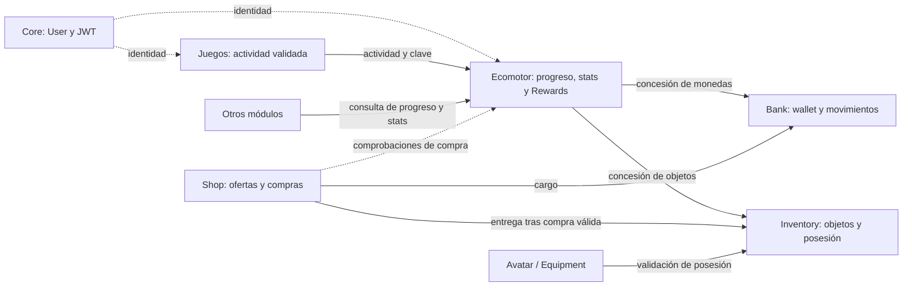

# Arquitectura candidata V2 · DuckyArenas — Equipo 5

## 1. Propósito y estado

Este documento recoge la arquitectura candidata V2 como dirección interna del
Equipo 5. Permite preparar una V1 pequeña, funcional, testeable e integrable antes
de implementar servicios y modelos de dominio. No constituye una aprobación del
profesor Óscar ni de contratos compartidos con otros equipos.

Se distinguen cuatro estados: **requisito funcional especificado**, **decisión
aceptada y documentada**, **propuesta candidata** y **pendiente de confirmación**.
Las responsabilidades y flujos V2 descritos aquí son propuestas candidatas salvo
cuando se identifica expresamente una decisión vigente o un requisito documental
trasladado desde la revisión externa. Los cambios respecto al
diseño V1 requieren revisión formal; este documento no deroga acuerdos anteriores.
No define campos ORM, migraciones, tablas ni endpoints definitivos.

## 2. Fuentes y criterios de autoridad

| Fuente | Autoridad y procedencia |
| --- | --- |
| `DAR3_ (1).pdf` | Referencia principal del alcance general y reparto entre equipos. Sus requisitos se recogen mediante la documentación del repositorio y la revisión externa comunicada. |
| `DuckyEcomotor.pdf` y `DAR_formulas.pdf` | Fuentes funcionales posteriores proporcionadas por Óscar. Prevalecen donde actualicen explícitamente una especificación anterior; los requisitos aquí trasladados proceden de la revisión externa comunicada. |
| [Registro de decisiones](decisions.md) | Fuente de decisiones aceptadas y de propuestas aún pendientes. Se respetan las decisiones vigentes hasta revisión formal. |
| [ERD de Ecomotor V1](erd/ecomotor.md) | Evidencia del diseño interno anterior de Parte A, A-01…A-16, y de sus contratos compartidos pendientes. No equivale a aprobación del conjunto del Equipo 5. |
| `11201_PR07_proyecto Ducky Arenas.pdf` (PR07) | Referencia de proceso y evaluación; sus condicionantes se recogen en la documentación del repositorio y la revisión externa comunicada. |
| Contexto de la candidata V2 | Orientación interna para esta propuesta; no sustituye requisitos verificados ni resuelve preguntas abiertas. |

Los requisitos documentales trasladados desde la revisión externa se identifican
como tales, sin afirmar lectura o verificación directa de los PDF ni reproducir
citas textuales. Se distinguen de decisiones aceptadas y propuestas internas;
las referencias de páginas se limitan a las comunicadas en esa revisión.

El alcance funcional atribuido a DAR3 en la documentación existente comprende
Ecomotor/evolución, avatar/inventario, Ecommerce/Bank y recompensas comunes;
el contrato de recompensas debe acordarse con Core. Los valores, fórmulas y
reglas que no se puedan verificar quedan pendientes, sin inventar requisitos.

## 3. Alcance y límites del Equipo 5

El Equipo 5 propone concentrar la autoridad sobre progreso, estadísticas RPG,
economía, objetos, compras y equipamiento en servicios propietarios. Los juegos
producen resultados y hechos de actividad validados; no deciden arbitrariamente
XP, monedas, saldo, stats canónicos ni evolución.

Como requisitos de DAR3 trasladados desde la revisión externa, se mantienen el
historial de épocas, el historial de equipamiento, el Museo Ducky y la distinción
entre piezas principales de equipamiento y complementos estéticos. Actualizar
las etapas no elimina estas funcionalidades: DAR3 establece seis piezas principales
por época. La especificación posterior actualiza la progresión a siete etapas
sin eliminar expresamente esa regla. La adaptación de los conjuntos y su alcance
V1 requieren definición conjunta, sin aprobar equipamiento automático al evolucionar.

Core (Equipo 0) es propietario de User, autenticación, JWT y la integración global.
El Equipo 5 no redefine User ni implementa autenticación paralela. La interfaz
presenta el estado canónico y solicita operaciones al servidor; no lo recalcula
como fuente de verdad ni aplica cambios críticos por su cuenta.

## 4. Módulos y responsabilidades candidatas

Los módulos de esta tabla son responsabilidades conceptuales, no un compromiso
de crear una app Django por fila.

| Módulo o capacidad | Responsabilidad y fuente de verdad | Coordinación |
| --- | --- | --- |
| Ecomotor y evolución | XP histórica acumulativa y no decreciente, nivel, progreso, etapas, evolución, especializaciones, stats RPG canónicos e historial relevante. Evalúa y coordina recompensas. | Recibe actividad validada y consulta reglas configuradas; solicita monedas a Bank y objetos a Inventory; participa con Bank y Shop en comprobaciones de saldo y condiciones de compra, sin poseer el saldo. |
| Rewards, dentro de Ecomotor | Identifica reglas y emisor; evalúa condiciones, vigencia, límites temporales, compatibilidad y repetibilidad cuando proceda; evita duplicados y registra trazabilidad de recompensas. | Coordina servicios propietarios sin duplicar su lógica. No exige app independiente en V1. |
| DuckyBank | Única fuente de verdad de wallet, saldo de Duki Coins, movimientos, créditos y débitos; concurrencia e idempotencia monetarias. | Otros módulos usan su servicio y nunca modifican directamente el saldo. |
| DuckyShop | Catálogo comercial, precios, disponibilidad comercial y proceso de compra. | Bank realiza el cargo e Inventory la entrega. Shop no posee saldo ni posesiones. |
| Inventory | Identidad y definición de objetos, coordinada con sus consumidores; posesión, cantidades, concesiones y consumos controlados e idempotentes cuando corresponda. | Shop referencia objetos para sus ofertas; Ecomotor concede recompensas a través del servicio propietario. |
| Avatar / Equipment | Apariencia, elementos equipados, compatibilidad y estado de equipamiento. | Valida posesión con Inventory; contempla historial de equipamiento y distingue piezas principales de complementos estéticos; la apariencia no reemplaza el progreso canónico. |
| Core — Equipo 0 | User, autenticación, JWT y mecanismos compartidos de identidad e integración global. | Proporciona identidad y contratos comunes. |
| Juegos y otros equipos | Resultados y hechos de actividad previamente validados en su dominio. | Comunican actividad y consultan progreso/stats mediante contratos acordados. |

## 5. Arquitectura conceptual

La lógica de negocio reside en servicios Python reutilizables. Vistas, endpoints
y templates delegan en ellos. El servidor valida las operaciones críticas y cada
servicio propietario escribe exclusivamente su estado.

Conceptos candidatos, sin aprobar modelos ORM nuevos:

| Concepto | Papel |
| --- | --- |
| `CharacterStats` | Representación canónica de las seis estadísticas RPG bajo autoridad de Ecomotor; persistencia o cálculo pendiente. |
| `XPEvent` | Trazabilidad de concesiones de XP. Ya aparece como entidad diseñada en el ERD V1; aquí se utiliza como concepto, sin aprobar nuevos campos ni su implementación V2. |
| `EvolutionEvent` | Trazabilidad de transiciones de etapa. También está diseñado en el ERD V1; su adaptación a V2 requiere revisión. |
| `RewardRule` | Regla configurable que vincula actividad con condiciones y recompensas; concepto propuesto, sin modelo ORM aprobado. |
| `RewardEvent` | Evidencia de evaluación y aplicación de una recompensa para trazabilidad e idempotencia; concepto propuesto, sin modelo ORM aprobado. |

La configuración debe concentrar umbrales de nivel, condiciones de evolución,
recompensas, desbloqueos y valores de progresión pendientes. Su soporte concreto
se decidirá después, sin dispersar reglas cambiantes en vistas o templates ni
introducir infraestructura adicional sin necesidad. No se fijan valores ficticios
como oficiales; D-16 sigue siendo una propuesta pendiente en el registro.

## 6. Diagrama de responsabilidades

Las flechas representan dependencias conceptuales, no llamadas HTTP obligatorias
ni fronteras de despliegue. La identidad de todos los consumidores debe integrarse
con Core; el diagrama simplifica esas relaciones.

## 7. Progresión, evolución, especializaciones y stats

La dirección funcional actual comunicada para V2 contempla siete etapas:

1. Prehistoria.
2. Griega.
3. Romana.
4. Renacentista.
5. Contemporánea.
6. Siglo XX.
7. Actual.

Según el requisito documental trasladado de `DuckyEcomotor.pdf`, páginas 6–7,
la evolución es automática cuando se cumplen sus requisitos y las
especializaciones aparecen dentro de la etapa Actual. Esto no determina
equipamiento automático: ese comportamiento continúa sujeto a revisión.
No se añaden umbrales ni condiciones de evolución o especialización.

Las seis estadísticas RPG canónicas son `ATK`, `DEF`, `LOG`, `SPE`, `VEL` e `INT`.
Las cinco especializaciones identificadas son Developer, Ciberseguridad, Sistemas,
Data y Gamer. La revisión externa comunica una discrepancia: `DuckyEcomotor.pdf`
usa **Data**, mientras `DAR_formulas.pdf` incluye **Data & IA** y `data_ia` como
código de ejemplo. Queda pendiente normalizar nombres y códigos, sin establecer
una equivalencia definitiva. Como propuesta técnica pendiente de aceptación,
se plantean identificadores internos estables y etiquetas de presentación
configurables, sin modificar el modelo de datos ni aprobar el código de ejemplo.
Las fórmulas concretas deben precisarse antes de cerrar el diseño y los contratos.

La XP histórica es acumulativa y no decreciente: compras, penalizaciones económicas
y consumo de objetos no la reducen. Nivel, etapa y especialización son conceptos
distintos; no se presupone una equivalencia entre nivel y etapa. Una barra de
progreso es una representación del estado canónico, nunca otro saldo de XP.

La XP o puntuación provisional de una partida se distingue de la recompensa
calculada a partir del resultado validado y de la XP histórica ya consolidada.
Una penalización dentro de la partida puede afectar al resultado o a la recompensa
antes de consolidarse; no descuenta XP histórica previamente concedida.

Quedan configurables los umbrales, las condiciones de evolución, los desbloqueos
y los parámetros de progresión. No se fijan fórmulas, requisitos de acceso a
especializaciones, valores de stats ni efectos de objetos sin confirmación.
El tratamiento de varios umbrales en una operación debe revisarse conservando
la trazabilidad; el ERD V1 ya exige registrar todas las evoluciones intermedias.

Se mantiene el requisito original de DAR3 de seis piezas principales por época,
diferenciadas de los complementos estéticos. Queda pendiente adaptar los conjuntos
a las siete etapas y concretar su alcance V1, sin inventar su contenido.
La candidata no adopta como invariantes obligatorios las nueve épocas, el
equipamiento automático al evolucionar, los rangos `INITIAL`,
`JUNIOR`, `MIDDLE`, `SENIOR`, `MASTER` ni la progresión antigua de XP por
especialización. Estos elementos están documentados en V1 y siguen pendientes
de revisión formal; omitirlos de V2 no declara revocada su aceptación anterior.

## 8. Servicios, contratos conceptuales y flujos

| Flujo | Operación conceptual y límite de autoridad |
| --- | --- |
| Juegos → Ecomotor | Enviar actividad validada, identidad verificable y clave estable de operación. Rewards evalúa la regla; el juego no impone la cantidad concedida. |
| Ecomotor → Bank | Solicitar concesión de monedas; Bank valida, registra y acredita mediante su servicio. |
| Ecomotor → Inventory | Solicitar concesión de objetos; Inventory valida identidad de objetos, posesión y cantidades, y registra la operación. |
| Shop / Ecomotor / Bank | Ecomotor participa en la comprobación de saldo y condiciones de compra descrita en la revisión de `DuckyEcomotor.pdf`, consultando al propietario Bank; el reparto de validaciones y la coordinación completa quedan pendientes. |
| Shop → Bank | Solicitar cargo por una compra validada en servidor; Bank comprueba fondos y evita el débito duplicado. |
| Shop → Inventory | Solicitar entrega tras compra válida conforme a la coordinación acordada; no entregar sin pago válido ni dejar un cargo sin resolución. |
| Avatar / Equipment → Inventory | Comprobar posesión antes de equipar y coordinar cambios que puedan afectar a esa posesión. Equipment valida compatibilidad. |
| Otros módulos → Ecomotor | Consultar progreso y stats canónicos a través de una interfaz de lectura, sin escribir sus datos directamente. |

Rewards recibe el hecho validado, identifica la regla, evalúa condiciones,
vigencia y límites temporales, entidad o módulo emisor, compatibilidad entre
recompensas y repetibilidad cuando corresponda. Comprueba idempotencia,
coordina XP/monedas/objetos y
registra el resultado para trazabilidad. El resumen debe distinguir resultados
aplicados, ya procesados o fallidos según el contrato que se acuerde.

La intervención de Ecomotor en compras es un requisito documental trasladado;
Bank conserva la autoridad sobre el saldo, Shop gestiona la compra e Inventory
la posesión. El reparto concreto de validaciones y quién coordina la operación
completa deben acordarse, incluyendo transacciones, idempotencia y fallos parciales.
Consultar el saldo no sustituye la validación de fondos de Bank al efectuar el cargo.

Como mínimo funcional de DAR3, sección 10, trasladado desde la revisión externa,
cada equipo de juego comunica el identificador único de actividad terminada,
el usuario que la completó, el tipo de juego, el resultado validado, la fecha y
hora y los datos necesarios para determinar la recompensa. El Equipo 5 devuelve
la XP y las monedas concedidas, la nueva pieza, evolución o logro si procede,
y la indicación de resultado ya procesado cuando sea un duplicado. Este mínimo
funcional no fija payloads, endpoints ni firmas técnicas definitivas.

Los contratos deberán precisar identidad y origen autorizados, referencia de
actividad o compra, alcance y construcción de la clave de operación, resultado,
errores y comportamiento ante reintentos. Son necesidades conceptuales, no un
esquema de payload, firma Python o endpoint aprobado.

Los servicios pueden invocarse desde distintos puntos de entrada mediante Python
cuando compartan ejecución. Según la revisión externa, `DAR_formulas.pdf`
describe una arquitectura objetivo con endpoints REST y eventos WebSocket,
incluyendo especificaciones y ejemplos documentales. Sus contratos concretos,
responsables y alcance V1 deben acordarse entre equipos; aquí no se inventan
endpoints ni se compromete toda la funcionalidad WebSocket para V1. Esta
arquitectura externa no obliga a usar HTTP para toda comunicación interna.

## 9. Integridad, transacciones e idempotencia

Una recompensa no debe aplicarse dos veces y una compra no debe descontar monedas
dos veces. La idempotencia debe ser persistente y abarcar los efectos coordinados,
no depender de desactivar un botón. Cada servicio valida y escribe su propio
estado, con restricciones de base de datos que complementan las comprobaciones
de aplicación y con operaciones diseñadas para concurrencia.

Como referencia aceptada de Parte A, el ERD V1 define que repetir una clave con
el mismo importe de XP no aplica nuevos efectos; reutilizarla con otro importe
produce conflicto sin cambios. La extensión de esa semántica a Rewards, Bank,
Shop e Inventory, y la relación entre sus claves, requiere contrato conjunto.

**D-19 sigue vigente para SQLite V1:**

- `transaction.atomic()` antes de leer el estado mutable relevante.
- `transaction_mode = "IMMEDIATE"`, `BEGIN IMMEDIATE` y timeout de 5 segundos.
- Restricciones de BD e idempotencia persistente como defensas obligatorias.
- Un único escritor efectivo para toda la BD; no hay serialización por usuario
  o fila y `select_for_update()` es un no-op en SQLite.
- Transacciones cortas, sin HTTP, I/O externo, esperas ni trabajo lento;
  `ATOMIC_REQUESTS` no es la solución adoptada.
- Si no se obtiene el lock en el timeout, fallo y rollback. Un reintento abre
  otra transacción y reutiliza la misma clave de operación idempotente.

Un fallo parcial no debe dejar incoherencias permanentes entre saldo, inventario
y recompensas. Si los servicios comparten BD y ejecución, deberá acordarse quién
abre y delimita la transacción exterior. Si hay servicios independientes o varias
transacciones, deberá definirse recuperación, compensación o reconciliación antes
de implementar el flujo. No se promete atomicidad global ni se escoge aquí esa
estrategia. D-19 no resuelve esta coordinación multidominio.

Una futura migración a un backend con bloqueo por fila requiere revisar la
política, no sustituir D-19 silenciosamente.

## 10. Integración con Core y otros equipos

Se respetan D-05, D-09, D-10 y D-17: User estándar en el repositorio temporal, sin
CustomUser ni login local, y responsabilidad global de Core. Las referencias
Django al usuario respetarán `settings.AUTH_USER_MODEL`. JWT pertenece a Core;
la forma de validar origen, permisos e identidad en contratos externos se acuerda
con ese equipo, sin crear mecanismos paralelos.

D-11 y D-12 mantienen los perfiles iniciales del Equipo 5 centralizados en
`apps/users/models.py`, actualmente sin campos de negocio ni signals de creación
automática. D-18 conserva rutas canónicas `apps.ecomotor` y `apps.users` y labels
`ecomotor` y `users`. La propiedad funcional de un servicio no exige mover modelos
ni cambiar esa estructura en esta revisión.

Los equipos de juegos validan resultados en su dominio; Ecomotor evalúa la
recompensa y Bank/Inventory controlan sus efectos. Deben acordarse formatos,
autorización, claves, errores, reintentos y consultas de stats/progreso con Core
y los equipos consumidores. REST y eventos WebSocket forman parte de la
arquitectura objetivo documental comunicada; la asignación de productores y
consumidores de eventos, los contratos y el alcance definitivo V1 siguen
pendientes. JWT permanece en Core. También debe concretarse el alcance de
las capacidades RPG completas en V1.

## 11. Alcance V1 y validación futura

Se propone una primera versión con un recorrido integrado reducido: actividad
validada, evaluación de una recompensa, actualización de progreso, concesión
económica o material, compra y equipamiento conforme al alcance acordado.
Según DAR3, tal como se comunica en la revisión externa, para la demostración
inicial bastan Prehistoria, Grecia y Roma. Este alcance de demostración propuesto
se distingue del catálogo completo de siete etapas y de la planificación
definitiva pendiente; no obliga a completar todo RPG.
Debe definirse y priorizarse cómo cubrir historial de épocas, historial de
equipamiento y Museo Ducky en V1. Como propuesta conceptual, el Museo podría
componer lecturas de progreso e inventario/equipamiento; no se aprueba un modelo
ni una app adicional. Se conserva el requisito de seis piezas principales por
época, diferenciadas de complementos estéticos; la adaptación de los conjuntos
a las siete etapas y su alcance V1 siguen pendientes, sin aprobar equipamiento
automático al evolucionar.

La revisión documental también comunica referencias a integraciones externas y
pedidos físicos. Su alcance debe distinguirse de la V1 mínima y acordarse antes
de planificar implementación; no se incorporan como obligaciones inmediatas.

La V1 debe priorizar servicios reutilizables, lecturas canónicas y operaciones
trazables, sin una app por concepto ni servicios desplegados adicionales por
motivos exclusivamente organizativos. Antes del ORM se revisarán el ERD y el
diccionario de datos, como recoge PR07 en el repositorio.

Al implementar serán necesarios tests de:

- XP no decreciente y separación respecto a compras, penalizaciones y consumos;
  progresión, evolución y stats con las reglas finalmente confirmadas.
- Evaluación de recompensas, condiciones, repetibilidad y límites configurados.
- Reintentos y conflictos de claves: ausencia de XP, créditos, cargos o entregas
  duplicados, también después de fallos parciales.
- Fondos insuficientes, cantidades y consumos válidos, posesión y compatibilidad
  de equipamiento, y conservación de la separación entre apariencia y progreso.
- Rollback o recuperación del flujo coordinado de recompensas y compras.
- Concurrencia real con `TransactionTestCase` y al menos una ejecución SQLite
  file-backed, incluyendo compras simultáneas y operaciones repetidas (D-19).
- Identidad, autorización y contratos de integración con Core y juegos;
  concordancia entre consultas canónicas y representaciones de interfaz.

Esta actualización es documental; no implementa ni ejecuta esos tests de dominio.

## 12. Decisiones vigentes, discrepancias y pendientes

Se mantienen D-01…D-04 para integración y trabajo en ramas, D-05 y D-09…D-12 para
usuarios/perfiles, D-07 para no cerrar diseños pendientes, D-17 ante el conflicto
PR07, D-18 para estructura y D-19 para concurrencia. D-06 y D-08 son fases cumplidas,
no compromisos nuevos. D-13…D-16 siguen registradas como propuestas pendientes:
la dirección interna V2 no cambia su estado ni confirma el reparto individual.

| Discrepancia o cuestión | Tratamiento y validación necesaria |
| --- | --- |
| Siete etapas V2 frente a nueve épocas V1 | Cambio funcional significativo respecto al ERD y a las aclaraciones antiguas. Verificar especificaciones posteriores con Óscar y revisar formalmente el diseño afectado. |
| Seis piezas y equipamiento automático | DAR3 exige seis piezas principales por época; la actualización a siete etapas no elimina expresamente ese requisito. Acordar adaptación de conjuntos y alcance V1 con Inventory/Equipment. El equipamiento automático al evolucionar, exigido por el ERD V1, no se da por aprobado para V2 y requiere revisión formal. |
| Especializaciones y XP de dominio | V1 usa AdminSys y Data & AI, progreso independiente y rangos fijos; V2 identifica Sistemas y Data sin cerrar XP/rangos. Confirmar equivalencias, acceso, cambio y conservación de progreso. |
| Normalización Data / Data & IA | La revisión externa identifica Data en `DuckyEcomotor.pdf` y Data & IA / `data_ia` en `DAR_formulas.pdf`. Acordar nomenclatura y códigos; identificadores estables y etiquetas configurables son una propuesta técnica pendiente. |
| Historial y Museo | Se conservan los requisitos trasladados de DAR3 sobre épocas, equipamiento, Museo y tipos de piezas; definir cobertura y prioridad V1 conservando las seis piezas principales por época y adaptando sus conjuntos a las siete etapas. |
| Stats y fórmulas | V2 incorpora seis stats canónicos; falta verificar fórmulas, efectos de objetos y alcance RPG V1 con las fuentes posteriores y consumidores. |
| Rewards dentro de Ecomotor | Compatible como dirección con la coordinación propuesta desde A, pero D-14/D-15 y contratos compartidos siguen pendientes de validación conjunta. |
| Coordinación de compras y recompensas | Acordar reparto de validaciones entre Ecomotor, Bank y Shop, coordinador completo, fronteras transaccionales, claves y entrega de Inventory; D-19 no garantiza atomicidad global. |
| PR07 frente a D-09/D-10 | Persiste el conflicto documentado sobre CustomUser y autenticación local. D-17 mantiene las decisiones existentes hasta aclaración de Óscar. También siguen abiertos CRUD evaluable y calendario. |
| Estado documental de Parte A | El registro y las decisiones pendientes reconocen el ERD V1 existente en `erd/ecomotor.md`. Su adaptación a V2 y la consolidación con los demás dominios siguen pendientes; su existencia no acredita revisión global ni aceptación de V2. |
| Integración y tiempo real | Concretar contratos REST y eventos WebSocket de la arquitectura objetivo comunicada, responsabilidades entre equipos y alcance V1; identidad/JWT pertenece a Core. |
| Integraciones externas y pedidos físicos | Referencias documentales comunicadas cuyo alcance, responsables y priorización deben acordarse separadamente de la V1 mínima. |
| Parámetros y catálogo | Confirmar umbrales, recompensas, desbloqueos, precios, objetos y reglas de evolución; no inventar valores oficiales. |

La aceptación interna A-01…A-16 registrada para V1 se conserva como antecedente.
Los puntos incompatibles de esta candidata requieren revisión explícita; no se
ordena implementar V2 contra el ERD V1 sin resolverlos.

## 13. Relación con otros documentos

- [decisions.md](decisions.md): registro principal de acuerdos. No se modifica ni
  se reclasifican sus propuestas desde esta candidata.
- [pending-decisions.md](pending-decisions.md): preguntas y trabajo abierto;
  lista operativa actualizada de validaciones, adaptación a V2, contratos y trabajo posterior; distingue el ERD V1 existente del diseño V2 pendiente.
- [erd/ecomotor.md](erd/ecomotor.md): ERD y diccionario V1 de Parte A;
  requiere revisión posterior frente a etapas, equipamiento, especializaciones
  y stats de V2 antes de implementar modelos.
- [team5-work-plan.md](team5-work-plan.md): plan operativo propuesto; habrá que
  revisar su alineación en un trabajo posterior, sin asumir cambios de alcance.

El ERD consolidado `docs/ERD.md` no existe en esta revisión, aunque el ERD de
Parte A lo menciona como destino futuro. El registro y la lista de decisiones
pendientes ya están actualizados para la candidata V2. La revisión del ERD, los
contratos y la formalización de los acuerdos pendientes siguen siendo trabajo
posterior sujeto a la revisión correspondiente.
