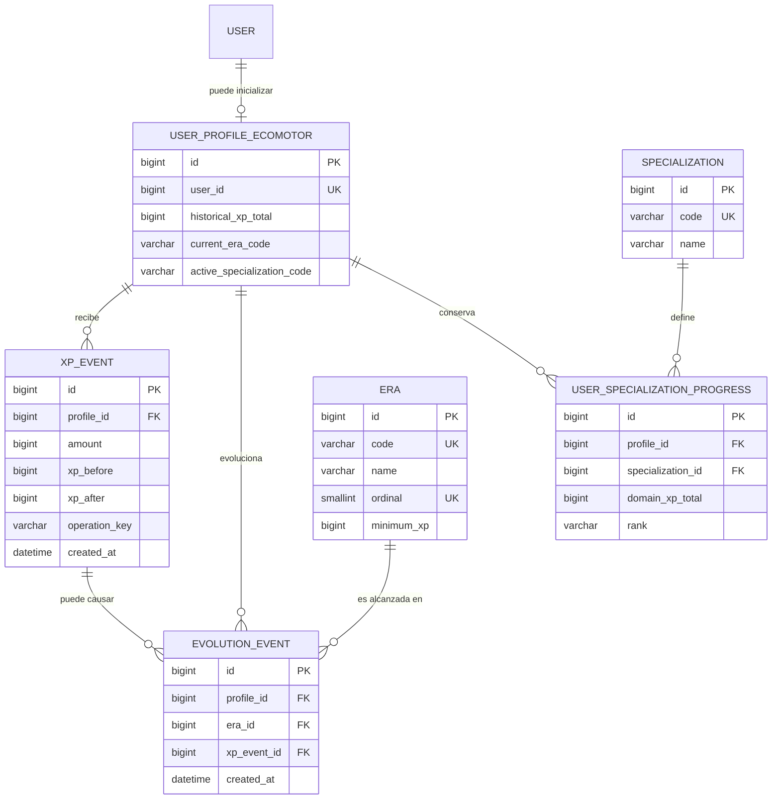
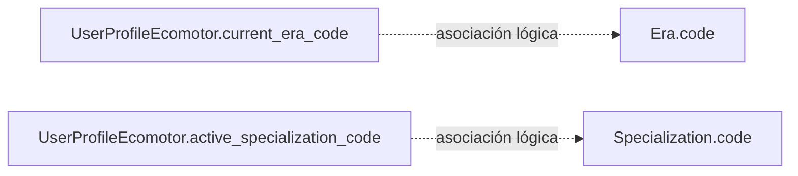

# ERD y diccionario de datos · Parte A — Ecomotor y evolución

## 1. Objetivo

Este documento describe el diseño de dominio y el diseño físico Django V1 de la
Parte A del Equipo 5 de DuckyArenas: **Ecomotor y evolución**.

Su finalidad es dejar revisados, antes de implementar el ORM:

- entidades;
- relaciones;
- cardinalidades;
- reglas `on_delete`;
- campos y nulabilidad;
- restricciones de integridad;
- asociaciones lógicas sin ForeignKey;
- reglas transaccionales que condicionan el modelo;
- estrategia de migración del perfil Ecomotor existente;
- límites y dependencias con otros dominios.

Este documento constituye la aportación de Parte A al Día 2 de PR07.

No representa por sí solo el ERD completo del Equipo 5. La visión consolidada
del Equipo 5 se mantendrá en `docs/ERD.md`.

---

## 2. Fuentes y estado de las decisiones

### 2.1. DAR3 — requisito funcional principal

DAR3 asigna a Parte A las siguientes responsabilidades:

- registrar XP histórica;
- definir épocas y umbrales de evolución;
- evolucionar automáticamente cuando se alcanza un umbral;
- conservar el historial de épocas;
- participar en el desbloqueo de piezas principales;
- preparar la información necesaria para el Museo Ducky;
- preparar un modelo inicial para especializaciones y XP de dominio.

DAR3 establece además que la XP representa progreso educativo y no se gasta.

Al llegar a Era Digital aparecen cinco especializaciones:

- Developer;
- Ciberseguridad;
- AdminSys;
- Gamer;
- Data & AI.

DAR3 describe cuatro rangos posteriores: Junior, Middle, Senior y Maestro.

### 2.2. PR07 — requisito de proceso

PR07 exige antes de implementar modelos:

- especificación formal de entidades;
- ERD visual;
- cardinalidades;
- reglas `on_delete`;
- diccionario de datos;
- revisión de normalización y justificación de claves foráneas.

La implementación ORM, migraciones y seeds pertenece a una fase posterior.

### 2.3. Aclaraciones funcionales de clase

Las aclaraciones utilizadas en este diseño establecen que:

- la progresión histórica comprende nueve épocas;
- la XP histórica es acumulativa y nunca se gasta;
- alcanzar una nueva época concede conjuntamente las seis piezas principales
  correspondientes;
- el nuevo set se equipa automáticamente;
- los sets anteriores se conservan y pueden volver a equiparse sin alterar la
  época real;
- una única concesión de XP puede atravesar varias épocas;
- en ese caso se procesan todas las evoluciones intermedias;
- las especializaciones conservan progresos independientes;
- existe un estado inicial previo a Junior;
- cambiar de especialización activa no elimina el progreso previo.

Los valores oficiales de los umbrales de XP no están definidos todavía.

### 2.4. Decisiones internas de Parte A

El diseño de Parte A está definido por A-01…A-16.

Las decisiones que afecten exclusivamente a Parte A se consideran aceptadas
internamente.

Las partes que constituyen contratos con inventario, Rewards u otros dominios
requieren además validación compartida.

---

## 3. Alcance del modelo V1

Parte A utilizará las siguientes entidades persistentes:

| Entidad | App física | Responsabilidad |
| --- | --- | --- |
| `UserProfileEcomotor` | `apps.users` | Estado agregado actual de progresión histórica |
| `Era` | `apps.ecomotor` | Catálogo persistente de épocas |
| `XPEvent` | `apps.ecomotor` | Historial inmutable de concesiones de XP histórica |
| `EvolutionEvent` | `apps.ecomotor` | Historial inmutable de evoluciones |
| `Specialization` | `apps.ecomotor` | Catálogo persistente de especializaciones |
| `UserSpecializationProgress` | `apps.ecomotor` | Progreso independiente por especialización |

`User` es una entidad externa proporcionada por el sistema de usuarios y
autenticación. Parte A no redefine `User`.

---

## 4. ERD de Parte A



### Asociaciones lógicas sin ForeignKey

Por decisión A-14, dos relaciones del agregado se almacenan mediante códigos
estables y no mediante claves foráneas:



Estas asociaciones son intencionadas.

Su objetivo es evitar una dependencia circular de aplicaciones:

```text
users → ecomotor → users
```

Los códigos deben ser estables y únicos.

La validez del código se comprobará mediante servicios de Parte A.

---

## 5. Cardinalidades

| Relación | Cardinalidad | Justificación |
| --- | --- | --- |
| `User → UserProfileEcomotor` | `1 → 0..1` | Un usuario puede existir antes de inicializar Ecomotor |
| `UserProfileEcomotor → XPEvent` | `1 → 0..N` | Un perfil puede recibir cualquier número de concesiones |
| `UserProfileEcomotor → EvolutionEvent` | `1 → 0..N` | Una evolución se registra una sola vez por época |
| `XPEvent → EvolutionEvent` | `1 → 0..N` | Una concesión puede no evolucionar o atravesar varias épocas |
| `Era → EvolutionEvent` | `1 → 0..N` | Una época puede ser alcanzada por muchos jugadores |
| `UserProfileEcomotor → UserSpecializationProgress` | `1 → 0..N` | Un usuario conserva progreso independiente en varias ramas |
| `Specialization → UserSpecializationProgress` | `1 → 0..N` | Una rama puede tener progreso asociado de muchos jugadores |

No existe ninguna relación N:M directa en Parte A V1.

Las relaciones conceptualmente N:M entre usuarios y especializaciones se
materializan mediante `UserSpecializationProgress`, porque la relación contiene
estado propio (`domain_xp_total` y `rank`).

---

## 6. Reglas de borrado

| Campo | Destino | `on_delete` | Motivo |
| --- | --- | --- | --- |
| `UserProfileEcomotor.user` | `User` | `CASCADE` | El perfil no tiene sentido sin el usuario |
| `XPEvent.profile` | `UserProfileEcomotor` | `CASCADE` | La eliminación global del perfil elimina su historial |
| `EvolutionEvent.profile` | `UserProfileEcomotor` | `CASCADE` | El historial pertenece al perfil |
| `EvolutionEvent.xp_event` | `XPEvent` | `CASCADE` | La evolución depende causalmente de esa concesión |
| `EvolutionEvent.era` | `Era` | `PROTECT` | Una época utilizada por el historial no debe eliminarse |
| `UserSpecializationProgress.profile` | `UserProfileEcomotor` | `CASCADE` | El progreso pertenece al perfil |
| `UserSpecializationProgress.specialization` | `Specialization` | `PROTECT` | Una rama usada no debe eliminarse |

`CASCADE` no significa que la aplicación permita eliminar manualmente eventos
históricos.

`XPEvent` y `EvolutionEvent` son funcionalmente inmutables. Su eliminación
individual no forma parte de la API de dominio V1.

El `CASCADE` existe únicamente para permitir una eliminación global coherente
del usuario/perfil cuando corresponda.

---

# 7. Diccionario de datos

## 7.1. `UserProfileEcomotor`

Ubicación:

```text
apps/users/models.py
```

El perfil actúa como agregado actual de Parte A.

### `user`

| Propiedad | Valor |
| --- | --- |
| Tipo | `OneToOneField(settings.AUTH_USER_MODEL)` |
| Null | No |
| Unique | Sí |
| `on_delete` | `CASCADE` |
| Propietario | Equipo 0 / sistema de usuarios |

Un `User` puede existir sin perfil Ecomotor.

La existencia de un perfil significa que la inicialización de Parte A ha sido
completada correctamente.

### `historical_xp_total`

| Propiedad | Valor |
| --- | --- |
| Tipo físico previsto | `PositiveBigIntegerField` |
| Null | No |
| Default | `0` |
| Semántica | XP histórica acumulada actual |

La XP histórica no se gasta.

Este campo es el estado agregado actual; `XPEvent` conserva el historial.

No contiene XP de especialización.

### `current_era_code`

| Propiedad | Valor |
| --- | --- |
| Tipo físico previsto | `CharField(max_length=32)` |
| Null | No |
| Default de modelo | Ninguno |
| FK | No |
| Semántica | Código estable de la época histórica actual |

Representa la época más avanzada cuya evolución ha sido formalmente procesada.

No debe derivarse silenciosamente de `historical_xp_total` durante lecturas.

No puede retroceder mediante operaciones normales.

La asociación lógica es:

```text
UserProfileEcomotor.current_era_code
→ Era.code
```

### `active_specialization_code`

| Propiedad | Valor |
| --- | --- |
| Tipo físico previsto | `CharField(max_length=32)` |
| Null | Sí |
| Blank | Sí |
| Default | `NULL` |
| FK | No |
| Semántica | Rama activa actualmente |

`NULL` significa que todavía no existe especialización activa.

La cadena vacía no se utilizará como segundo estado equivalente a `NULL`.

La asociación lógica es:

```text
UserProfileEcomotor.active_specialization_code
→ Specialization.code
```

Cambiar esta propiedad no elimina ni reinicia los progresos almacenados en
`UserSpecializationProgress`.

---

## 7.2. `Era`

Ubicación:

```text
apps/ecomotor/models.py
```

Catálogo persistente de épocas históricas.

### `code`

| Propiedad | Valor |
| --- | --- |
| Tipo | `CharField(max_length=32)` |
| Null | No |
| Unique | Sí |
| Mutable | No como identidad funcional |

Código técnico estable utilizado para integraciones y para
`UserProfileEcomotor.current_era_code`.

No se han fijado todavía los literales definitivos de todos los códigos.

### `name`

| Propiedad | Valor |
| --- | --- |
| Tipo | `CharField(max_length=100)` |
| Null | No |
| Semántica | Nombre visible |

Puede cambiarse sin alterar la identidad de la época.

### `ordinal`

| Propiedad | Valor |
| --- | --- |
| Tipo | `PositiveSmallIntegerField` |
| Null | No |
| Unique | Sí |
| Restricción | `ordinal > 0` |

Define el orden histórico.

Prehistoria ocupa el ordinal `1`.

Los ordinales configurados forman un prefijo continuo desde `1`.

La continuidad es una regla de catálogo y no se resuelve únicamente mediante
un `CheckConstraint` por fila.

### `minimum_xp`

| Propiedad | Valor |
| --- | --- |
| Tipo | `PositiveBigIntegerField` |
| Null | No |
| Restricción | `minimum_xp >= 0` |

XP histórica mínima necesaria para alcanzar la época.

Prehistoria utiliza `0` como umbral inicial de Parte A.

Los umbrales de épocas posteriores deben crecer estrictamente con el ordinal.

Los valores oficiales concretos siguen pendientes.

---

## 7.3. `XPEvent`

Ubicación:

```text
apps/ecomotor/models.py
```

Registro inmutable de una concesión de XP histórica aceptada.

### `profile`

| Propiedad | Valor |
| --- | --- |
| Tipo | `ForeignKey(UserProfileEcomotor)` |
| Null | No |
| `on_delete` | `CASCADE` |
| `related_name` previsto | `xp_events` |

### `amount`

| Propiedad | Valor |
| --- | --- |
| Tipo | `PositiveBigIntegerField` |
| Null | No |
| Restricción | `amount > 0` |

V1 no permite concesiones de XP cero ni negativas.

Correcciones/reversiones de XP quedan fuera de V1.

### `xp_before`

| Propiedad | Valor |
| --- | --- |
| Tipo | `PositiveBigIntegerField` |
| Null | No |
| Restricción | `>= 0` |

Snapshot de XP histórica inmediatamente anterior a la concesión.

### `xp_after`

| Propiedad | Valor |
| --- | --- |
| Tipo | `PositiveBigIntegerField` |
| Null | No |
| Restricción | `>= 0` |

Debe cumplirse:

```text
xp_after = xp_before + amount
```

Esta igualdad debe protegerse también mediante constraint de base de datos si
el backend permite expresarla limpiamente.

### `operation_key`

| Propiedad | Valor |
| --- | --- |
| Tipo | `CharField(max_length=255)` |
| Null | No |
| Vacío | No permitido |
| Unique global | No |
| Unique por perfil | Sí |

Identificador opaco y estable utilizado para idempotencia local de Parte A.

Restricción:

```text
UNIQUE(profile, operation_key)
```

La construcción definitiva de la clave pertenece al consumidor/Rewards.

Parte A no interpreta ni normaliza semánticamente el valor.

### `created_at`

| Propiedad | Valor |
| --- | --- |
| Tipo | `DateTimeField(auto_now_add=True)` |
| Null | No |

Momento en que la concesión quedó registrada.

---

## 7.4. `EvolutionEvent`

Ubicación:

```text
apps/ecomotor/models.py
```

Registro inmutable de una evolución histórica procesada.

Prehistoria inicial **no** genera un `EvolutionEvent`.

### `profile`

| Propiedad | Valor |
| --- | --- |
| Tipo | `ForeignKey(UserProfileEcomotor)` |
| Null | No |
| `on_delete` | `CASCADE` |
| `related_name` previsto | `evolution_events` |

### `era`

| Propiedad | Valor |
| --- | --- |
| Tipo | `ForeignKey(Era)` |
| Null | No |
| `on_delete` | `PROTECT` |
| `related_name` previsto | `evolution_events` |

Restricción:

```text
UNIQUE(profile, era)
```

Un usuario solo puede registrar una evolución formal hacia una misma época.

### `xp_event`

| Propiedad | Valor |
| --- | --- |
| Tipo | `ForeignKey(XPEvent)` |
| Null | No |
| `on_delete` | `CASCADE` |
| `related_name` previsto | `evolutions` |

Una concesión puede causar cero, una o varias evoluciones.

Debe cumplirse lógicamente:

```text
EvolutionEvent.profile
==
EvolutionEvent.xp_event.profile
```

Esta regla cruza relaciones y se validará mediante servicios de dominio.

### `created_at`

| Propiedad | Valor |
| --- | --- |
| Tipo | `DateTimeField(auto_now_add=True)` |
| Null | No |

Momento de procesamiento de la evolución.

---

## 7.5. `Specialization`

Ubicación:

```text
apps/ecomotor/models.py
```

Catálogo persistente de ramas tecnológicas.

### `code`

| Propiedad | Valor |
| --- | --- |
| Tipo | `CharField(max_length=32)` |
| Null | No |
| Unique | Sí |
| Mutable | No como identidad funcional |

El código se utiliza también en:

```text
UserProfileEcomotor.active_specialization_code
```

### `name`

| Propiedad | Valor |
| --- | --- |
| Tipo | `CharField(max_length=100)` |
| Null | No |

Nombre visible de la especialización.

Las cinco ramas conocidas funcionalmente son:

```text
Developer
Ciberseguridad
AdminSys
Gamer
Data & AI
```

Los códigos técnicos definitivos se fijarán junto con los datos maestros.

---

## 7.6. `UserSpecializationProgress`

Ubicación:

```text
apps/ecomotor/models.py
```

Conserva de forma independiente el progreso de un jugador en cada rama.

### `profile`

| Propiedad | Valor |
| --- | --- |
| Tipo | `ForeignKey(UserProfileEcomotor)` |
| Null | No |
| `on_delete` | `CASCADE` |
| `related_name` previsto | `specialization_progresses` |

### `specialization`

| Propiedad | Valor |
| --- | --- |
| Tipo | `ForeignKey(Specialization)` |
| Null | No |
| `on_delete` | `PROTECT` |
| `related_name` previsto | `user_progresses` |

Restricción:

```text
UNIQUE(profile, specialization)
```

### `domain_xp_total`

| Propiedad | Valor |
| --- | --- |
| Tipo | `PositiveBigIntegerField` |
| Null | No |
| Default | `0` |
| Restricción | `>= 0` |

XP específica de la rama.

Nunca se mezcla con `historical_xp_total`.

Las reglas oficiales para conceder XP de dominio siguen pendientes.

### `rank`

| Propiedad | Valor |
| --- | --- |
| Tipo | `CharField(max_length=16)` |
| Null | No |
| Implementación prevista | `TextChoices` |
| Default | `INITIAL` |

Valores V1:

```text
INITIAL
JUNIOR
MIDDLE
SENIOR
MASTER
```

`INITIAL` representa el estado inicial previo a los cuatro ascensos descritos
funcionalmente.

El rango es estado explícito.

No se derivará automáticamente de `domain_xp_total` hasta que las reglas
oficiales de progresión de especialización estén definidas.

---

# 8. Restricciones de integridad

## 8.1. Restricciones protegidas por la base de datos

El diseño exige como mínimo:

| Invariante | Protección |
| --- | --- |
| Un perfil Ecomotor por usuario | `OneToOneField` |
| XP histórica no negativa | constraint/campo positivo |
| Código de Era único | `UNIQUE` |
| Código de Era no vacío | constraint |
| Ordinal de Era único | `UNIQUE` |
| Ordinal de Era mayor que cero | constraint |
| `minimum_xp >= 0` | constraint |
| `XPEvent.amount > 0` | constraint |
| `xp_before >= 0` | constraint/campo positivo |
| `xp_after >= 0` | constraint/campo positivo |
| `xp_after = xp_before + amount` | `CheckConstraint` |
| `operation_key` no vacío | constraint |
| Una operación por perfil y clave | `UNIQUE(profile, operation_key)` |
| Una evolución por perfil y Era | `UNIQUE(profile, era)` |
| Código de Specialization único | `UNIQUE` |
| Código de Specialization no vacío | constraint |
| Una fila de progreso por perfil/rama | `UNIQUE(profile, specialization)` |
| XP de dominio no negativa | constraint/campo positivo |
| Rango dentro de valores V1 | choices + constraint de BD |

Los nombres concretos de los constraints se fijarán durante la implementación
ORM sin modificar estas invariantes.

## 8.2. Reglas de servicio

Las siguientes reglas no deben intentarse resolver únicamente mediante
constraints por fila:

```text
ordinales Era continuos desde 1
umbrales Era estrictamente crecientes
Prehistoria = primer estado
current_era_code referencia un Era válido
active_specialization_code referencia una Specialization válida
no regresión de época
especialización activa solo cuando corresponda funcionalmente
EvolutionEvent.profile == XPEvent.profile
procesar todas las épocas intermedias
historial inmutable
XP histórica y XP de dominio separadas
```

Estas reglas corresponden a los servicios de dominio de Parte A.

---

# 9. Inicialización del Ecomotor — A-12

La inicialización será explícita mediante:

```text
initialize_ecomotor_progress(user)
```

No se utilizarán signals.

La operación será transaccional e idempotente.

En una primera inicialización válida:

```text
historical_xp_total = 0
current_era_code = <código estable de Prehistoria>
active_specialization_code = NULL
```

Parte A solicitará además a Parte B la concesión y equipamiento del set
prehistórico dentro de la misma operación transaccional.

La inicialización:

- no crea `XPEvent`;
- no crea `EvolutionEvent`;
- no debe ejecutarse como efecto secundario de una lectura;
- no debe resetear un perfil ya existente.

El catálogo `Era` debe existir previamente.

---

# 10. Concesión de XP y evolución — A-06 / A-07 / A-13

La operación pública prevista es:

```text
grant_historical_xp(user, amount, operation_key)
```

Una concesión aceptada realiza conceptualmente:

```text
1. entrar en una transacción
2. serializar la modificación del agregado
3. comprobar idempotencia
4. obtener XP anterior
5. crear un único XPEvent
6. actualizar XP histórica acumulada
7. localizar todas las nuevas Eras alcanzadas
8. crear un EvolutionEvent por cada Era
9. solicitar a B cada set histórico alcanzado
10. equipar únicamente el set de la Era final
11. actualizar current_era_code
12. confirmar toda la operación
```

Una única concesión puede producir:

```text
0..N EvolutionEvent
```

Todas las épocas intermedias deben registrarse.

Ejemplo conceptual:

```text
Roma
+ concesión grande de XP
→ Edad Media
→ Renacimiento
→ Revolución Industrial
```

produce tres `EvolutionEvent`, todos causados por el mismo `XPEvent`.

Los tres sets se conceden.

Solo el set correspondiente a la última Era alcanzada se equipa
automáticamente.

---

# 11. Idempotencia — A-13

La identidad local de una concesión es:

```text
(profile, operation_key)
```

Caso de reintento válido:

```text
misma operation_key
+
mismo amount
```

Resultado:

```text
no se vuelve a aplicar XP
no se crean nuevos eventos
se informa de que ya fue procesada
```

Caso conflictivo:

```text
misma operation_key
+
amount diferente
```

Resultado:

```text
IdempotencyConflict
sin modificación de estado
```

La unicidad de base de datos actúa como defensa adicional:

```text
UNIQUE(profile, operation_key)
```

---

# 12. Concurrencia SQLite — C-01 / D-19

La V1 utiliza SQLite.

SQLite no proporciona row locking efectivo mediante `select_for_update()`.

La política transversal aprobada para V1 es:

```text
transaction.atomic()
+
BEGIN IMMEDIATE
+
constraints de base de datos
+
idempotencia
```

La configuración global aprobada para el proyecto es:

```python
DATABASES["default"]["OPTIONS"] = {
    "transaction_mode": "IMMEDIATE",
    "timeout": 5,
}
```

La modificación de `config/settings.py` pertenece a la arquitectura transversal,
no a este documento/PR de Parte A.

Bajo SQLite:

```text
BEGIN IMMEDIATE
```

es la fuente efectiva de serialización de escritores.

`select_for_update()` podrá mantenerse en los servicios donde conceptualmente
se pretende bloquear el agregado, pero es un no-op bajo SQLite y no se
considerará la garantía de concurrencia de V1.

Condiciones:

```text
la transacción debe empezar antes de leer estado mutable
las transacciones deben ser cortas
no debe haber I/O externo o trabajo lento dentro de ellas
no se utilizará ATOMIC_REQUESTS para resolver esta necesidad
si el lock supera 5 segundos la operación falla y hace rollback
un retry abre una transacción nueva
el retry reutiliza la misma operation_key
```

SQLite serializa escritores de toda la base de datos, no únicamente del perfil
afectado.

Una futura base de datos con row locking podrá utilizar
`select_for_update()` como mecanismo real sin modificar las invariantes del
dominio.

---

# 13. Estrategia de migración del perfil existente — M-01

Actualmente puede existir una versión legacy de `UserProfileEcomotor` que solo
contenga la relación con `User`.

Esas filas no se reinterpretarán automáticamente como progresos inicializados.

La migración hacia el esquema V1 seguirá una política fail-closed.

Si no existen perfiles legacy:

```text
migración continúa
→ esquema final V1
```

Si existen perfiles legacy:

```text
no asignar Prehistoria automáticamente
no eliminar filas
no llamar a Parte B
no inventar estado
→ abortar con error explícito
```

La migración puede utilizar técnicamente un estado temporal nullable para
`current_era_code`, siempre que al terminar el esquema final sea:

```text
current_era_code NOT NULL
```

No existirá un default de modelo para `current_era_code`.

Esto evita que:

```python
UserProfileEcomotor.objects.create(user=user)
```

pueda crear silenciosamente un perfil parcialmente inicializado.

---

# 14. Especializaciones — A-09

El progreso histórico y el progreso de especialización son dominios separados:

```text
historical_xp_total
!=
domain_xp_total
```

La selección de una rama no reinicia la historia.

Cada rama conserva su propio:

```text
domain_xp_total
rank
```

El progreso se crea de forma lazy cuando una rama es seleccionada por primera
vez.

Cambiar de rama activa:

```text
no modifica historical_xp_total
no modifica current_era_code
no elimina el progreso de otras ramas
```

No se mantiene historial de cambios de especialización en V1.

Las reglas de XP de dominio y de ascenso siguen pendientes y no se inventan en
este diseño.

---

# 15. Historial y Museo — A-16

Parte A proporcionará posteriormente una API de lectura específica:

```text
get_ecomotor_history(user)
```

El consumidor no tendrá que consultar directamente las tablas de eventos.

El historial conceptual incluye:

```text
estado inicial: Prehistoria
+
XPEvent ordenados
+
EvolutionEvent ordenados
```

Prehistoria no se falsifica mediante un `EvolutionEvent`.

El Museo Ducky no requiere un modelo propio en Parte A.

Será una composición de:

```text
Parte A
→ historia de progresión

Parte B
→ sets y piezas conservados
```

---

# 16. Frontera con Parte B

Parte A decide cuándo ocurre una evolución.

Parte B es propietaria del inventario, piezas, sets y equipamiento.

Parte A no modifica directamente modelos de inventario.

Contrato conceptual mínimo aceptado por Parte A:

```text
grant_historical_set(user, era)
equip_historical_set(user, era)
```

Semántica esperada:

```text
grant_historical_set
→ concede las seis piezas de esa Era
→ es idempotente
→ conserva sets anteriores

equip_historical_set
→ cambia apariencia/equipamiento
→ no modifica XP
→ no modifica current_era_code
```

Este contrato afecta a un dominio compartido y necesita validación conjunta con
Parte B antes de considerarse contrato definitivo del Equipo 5.

---

# 17. Frontera con Rewards

DAR3 establece un servicio común de recompensas que recibe resultados validados,
evita recompensas duplicadas, registra el evento, añade XP/monedas y procesa
desbloqueos o evolución.

Parte A no es propietaria del resultado del juego ni debe modificar directamente
modelos de los equipos 1–4.

Contrato conceptual hacia Parte A:

```text
grant_historical_xp(
    user,
    amount,
    operation_key,
)
```

Rewards decide la XP histórica concedida y proporciona una clave de operación
estable.

Parte A:

```text
aplica XP
registra XPEvent
procesa evoluciones
devuelve el estado resultante
```

La atomicidad global futura entre:

```text
Rewards
Parte A
Parte B
Parte C
```

sigue siendo una decisión compartida.

C-01 garantiza la política de concurrencia SQLite, pero no decide por sí sola
qué servicio abre la transacción exterior de una recompensa multidominio.

---

# 18. Entidades deliberadamente excluidas

No forman parte del modelo persistente de Parte A V1:

| Elemento | Motivo |
| --- | --- |
| `RewardEvent` | Pertenece al diseño compartido de Rewards |
| `Inventory` | Parte B |
| `Item` / `Piece` | Parte B |
| `HistoricalSet` | Parte B |
| `Equipment` | Parte B |
| `Wallet` | Parte C |
| `Transaction` financiera | Parte C |
| `Product` / tienda | Parte C |
| `Museum` | Es una composición de lectura A+B |
| `MuseumEntry` | No se necesita persistencia propia |
| `SpecializationSwitchEvent` | Historial de switches fuera de V1 |
| `Rank` como tabla | No necesita catálogo persistente en V1 |
| `EraThresholdHistory` | Versionado de umbrales fuera de V1 |
| FK directa a partidas/juegos | Evitar acoplamiento con equipos 1–4 |
| JSON genérico de metadata | No existe requisito que lo justifique |

---

# 19. Política de catálogo de épocas — A-15

El catálogo no necesita contener obligatoriamente las nueve épocas desde la
primera implementación.

Puede contener un prefijo continuo, por ejemplo para una demo:

```text
Prehistoria
Grecia
Roma
```

Reglas:

```text
Prehistoria = ordinal 1
Prehistoria.minimum_xp = 0
ordinales continuos
umbrales estrictamente crecientes
nuevas Eras solo al final del prefijo configurado
código estable
nombre visible editable
Eras usadas no se eliminan normalmente
```

La última Era configurada significa:

```text
no existe siguiente Era configurada actualmente
```

y no necesariamente:

```text
es la última Era narrativa definitiva
```

Cambiar un umbral no debe:

```text
regresar usuarios
reescribir EvolutionEvent
crear evoluciones silenciosas en una lectura
```

La reconciliación masiva por cambio de umbrales queda fuera de V1.

---

# 20. Inmutabilidad y Admin

`XPEvent` y `EvolutionEvent` representan historial.

Funcionalmente deben ser de solo lectura:

```text
consultar
buscar
filtrar
```

pero no:

```text
crear manualmente
editar
eliminar individualmente
```

La implementación concreta de estas restricciones en Django Admin corresponde
a una fase posterior.

---

# 21. Estado inicial y ausencia de estados parciales

Parte A no define un perfil parcialmente inicializado como estado válido.

Conceptualmente solo existen:

```text
User sin UserProfileEcomotor
```

o:

```text
User
+
UserProfileEcomotor completamente inicializado
```

Un perfil válido tiene siempre:

```text
historical_xp_total >= 0
current_era_code válido
```

La especialización activa sí puede ser:

```text
NULL
```

---

# 22. Lecturas públicas previstas

La API pública conceptual de Parte A será:

```text
initialize_ecomotor_progress(user)

grant_historical_xp(
    user,
    amount,
    operation_key,
)

select_specialization(
    user,
    specialization,
)

get_ecomotor_progress(user)

get_ecomotor_history(user)
```

No existirán setters públicos para:

```text
historical_xp_total
current_era_code
XPEvent
EvolutionEvent
```

La modificación de estado se realizará mediante operaciones de dominio.

---

# 23. Cuestiones todavía pendientes

Estas cuestiones no bloquean el ERD de Parte A:

| Cuestión | Estado |
| --- | --- |
| Valores oficiales de XP por Era | Pendiente |
| XP concedida por actividades | Pendiente |
| Reglas de XP de dominio | Pendiente |
| Reglas de ascenso de especializaciones | Pendiente |
| Códigos técnicos definitivos de datos maestros | Se fijarán al preparar datos maestros |
| Estrategia concreta de seed | Fase posterior |
| Contrato A → B definitivo | Pendiente validación conjunta |
| Transacción exterior Rewards/A/B/C | Pendiente decisión compartida |
| Construcción global de `operation_key` | Responsabilidad/contrato Rewards |
| Integración final con User/auth del Equipo 0 | Pendiente integración global |

No se introducirán valores inventados como si fueran requisitos oficiales.

---

# 24. Trazabilidad

| Diseño | Origen |
| --- | --- |
| Registrar XP histórica | DAR3 Parte A |
| Épocas y umbrales | DAR3 Parte A |
| Evolución automática | DAR3 Parte A |
| Historial de épocas | DAR3 Parte A |
| Preparar especializaciones y XP de dominio | DAR3 Parte A |
| XP histórica acumulativa/no gastable | DAR3 + aclaración funcional |
| `UserProfileEcomotor` como agregado | A-01 / A-04 |
| `XPEvent` inmutable | A-02 |
| `Era` persistente | A-03 / A-15 |
| `current_era_code` persistido | A-04 / A-14 |
| `EvolutionEvent` | A-05 |
| Evoluciones múltiples | A-06 |
| Atomicidad/idempotencia | A-07 / A-13 |
| Contrato A → B | A-08, compartido pendiente |
| Especializaciones independientes | A-09 |
| API pública de Parte A | A-10 / A-16 |
| Frontera Rewards → A | A-11 |
| Inicialización explícita | A-12 |
| Asociaciones mediante códigos | A-14 |
| Museo como composición A+B | A-16 |
| Migración legacy fail-closed | M-01 |
| Concurrencia SQLite V1 | C-01 / D-19 |
| ERD, cardinalidades y `on_delete` previos al ORM | PR07 Día 2 |

---

# 25. Estado de revisión

Con este documento quedan definidos para Parte A:

```text
entidades
relaciones
cardinalidades
campos
nulabilidad
on_delete
constraints
asociaciones lógicas
límites de dominio
reglas de migración
condicionantes de concurrencia
dependencias compartidas
```

No se modifican todavía:

```text
apps/users/models.py
apps/ecomotor/models.py
migrations/
config/settings.py
```

La implementación ORM deberá respetar este documento.

Parte A puede considerar completado su **diseño documental del Día 2** cuando
este archivo haya sido revisado y aceptado en el repositorio.

El **Día 2 del Equipo 5 completo** solo podrá cerrarse después de incorporar y
consolidar también los diseños de inventario, economía y las relaciones
compartidas correspondientes.

---
