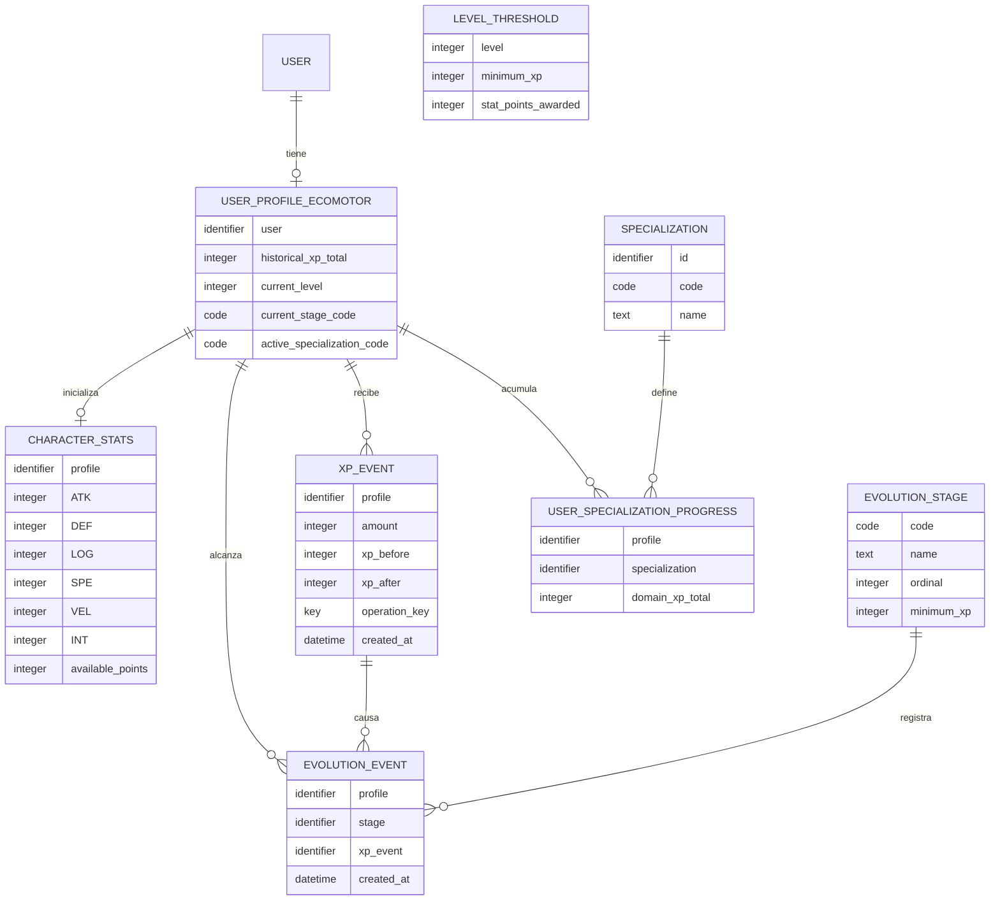

# Ecomotor y evolución · ERD V2 provisional de Parte A

## 1. Estado, fuentes y alcance

Diseño documental aceptado **internamente por Parte A**, V2-A1…V2-A29, con las
condiciones del [registro](../decisions.md). No es aprobación global de Óscar,
Core ni Partes B/C, ni autorización del ORM definitivo. D-01…D-19 siguen intactas;
D-13…D-16 siguen pendientes. No se implementan modelos ni migraciones aquí.

DAR3 es la referencia general. Las especificaciones posteriores de
`DuckyEcomotor.pdf`, `DAR_formulas.pdf`, `DAR_DuckyClash.pdf`, `DuckyTraining.pdf`
y `DuckyEscape.pdf` prevalecen cuando actualizan explícitamente una anterior.
Se utilizan requisitos contrastados trasladados por revisión externa y la
[arquitectura](../architecture.md), sin afirmar lectura directa de los PDF.
Ejemplos numéricos y código no constituyen parámetros oficiales.

Este documento sustituye la descripción operativa V1 por el diseño V2 provisional.
A-01…A-16 se conservan como antecedentes en §10; no se revocan retroactivamente.
El ERD consolidado del Equipo 5, los contratos y el ORM definitivo siguen pendientes.

## 2. Entidades y cardinalidades

Ocho entidades principales: perfil en `apps.users`; las otras siete en
`apps.ecomotor`. Se conservan las rutas y labels de D-18. Core conserva User y
autenticación; las relaciones al usuario utilizarán `settings.AUTH_USER_MODEL`.

Los tipos del diagrama son semánticos, no clases ORM ni longitudes definitivas.
Las asociaciones del perfil con `EvolutionStage.code`, `LevelThreshold.level`
y `Specialization.code` son referencias lógicas por valor, no FKs físicas nuevas
hacia `apps.ecomotor`; deben validarse en los servicios. La especialización activa
es nullable y solo corresponde a Actual. Esto conserva la separación entre apps
sin introducir una dependencia circular de modelos.

User puede no tener perfil; cada perfil pertenece a un User y es único por User.
La relación física OneToOne permite cero o un CharacterStats por perfil; un perfil
**correctamente inicializado exige exactamente uno**, garantizado por inicialización
transaccional, no por la mera unicidad. Cada evento y progreso pertenece a un perfil.
Un XPEvent puede causar cero o varias evoluciones, cada una con una sola causa.
Cada catálogo puede tener cero o muchas referencias históricas/progresos.

## 3. Diccionario V2 provisional

El diccionario detalla tipos Django **previstos**, sin implementar ORM ni
migraciones. Las reglas aceptadas internamente se distinguen de propuestas de
representación física y parámetros pendientes. D-12 sigue describiendo los perfiles
implementados hoy; los nuevos campos son diseño documental futuro.

| Entidad | Datos y significado | Integridad y trazabilidad |
| --- | --- | --- |
| UserProfileEcomotor | `user`: identidad Core; `historical_xp_total`: XP histórica consolidada; `current_level`: nivel alcanzado; `current_stage_code`: etapa; `active_specialization_code`: código nullable de especialización activa | Un perfil por User; XP acumulativa no negativa y no decreciente; códigos y nivel válidos según catálogos; V2-A6/A7/A21/A29 |
| CharacterStats | `profile`: OneToOne; `ATK`, `DEF`, `LOG`, `SPE`, `VEL`, `INT`: atributos persistentes; `available_points`: puntos disponibles para asignar | Uno por perfil inicializado; asignación transaccional sin gastar puntos dos veces; límites y valores iniciales pendientes; V2-A2/A8/A17/A18 |
| LevelThreshold | `level`: nivel único; `minimum_xp`: umbral independiente del de etapas; `stat_points_awarded`: puntos concedidos al alcanzar el nivel | Niveles positivos consecutivos; primer umbral XP 0; puntos otorgados no negativos; cantidades oficiales y cambios administrativos pendientes; V2-A7/A20 |
| EvolutionStage | `code`: estable y único; `name`: presentación; `ordinal`: único; `minimum_xp`: umbral | Exactamente siete etapas, ordinales consecutivos 1–7; Prehistoria XP 0 y umbrales estrictamente crecientes; comprobación del orden entre filas en validación de configuración; V2-A1/A9/A21 |
| XPEvent | `profile`, `amount`, `xp_before`, `xp_after`, `operation_key`, `created_at` | Cantidad positiva; snapshots coherentes; clave persistente por perfil; historial inmutable; V2-A10/A22 |
| EvolutionEvent | `profile`, `stage`, `xp_event` causal, `created_at` | Unicidad perfil/etapa; mismo perfil que la causa; todas las etapas cruzadas registradas; V2-A5/A11/A23 |
| Specialization | `id`: identificador; `code`: estable y único; `name`: etiqueta | Catálogo protegido cuando está referenciado; códigos definitivos pendientes; V2-A24 |
| UserSpecializationProgress | `profile`, `specialization`, `domain_xp_total`: XP de dominio acumulada | Unicidad por pareja; XP no negativa e independiente de XP histórica; sin `rank` en el mínimo; V2-A25/A26 |

`RewardRule` y `RewardEvent` son conceptos compartidos candidatos (V2-A15/A16),
fuera de las ocho entidades físicas mínimas. No se aprueban campos, FKs, tablas,
apps ni contratos. La trazabilidad de XP de dominio se concretará con Rewards;
no se inventa aquí una novena entidad ni se reutiliza XPEvent como si fueran la
misma magnitud.

### Detalle técnico previsto por campo

`Null` expresa `null` de almacenamiento; todas las relaciones requieren destino
existente salvo el código nullable de especialización activa. `Unique` se refiere
al campo individual: las unicidades compuestas se indican en constraints.
`—` en default significa **sin default de modelo**; el servicio debe proporcionar
el valor. Un default propuesto no inicializa por sí solo el agregado ni autoriza
backfills legacy. Se propone `blank=False` salvo el código activo nullable
(`blank=True`, normalizando ausencia a NULL, no a cadena vacía).

`BigAutoField` para identificadores sigue `DEFAULT_AUTO_FIELD` actual, sin duplicar
User. `CharField` con longitudes 32 (códigos), 100 (nombres) y 255 (clave) retoma
el antecedente V1 como **previsión pendiente de confirmar**, especialmente con los
contratos de claves. `related_name`, índices adicionales y nombres físicos de
constraints se concretarán antes del ORM; no se aprueban aquí. `created_at` es
fecha de registro local, no fecha de actividad recibida del juego.

### 3.1. `UserProfileEcomotor` · `apps.users`

| Campo | Tipo Django previsto | Null | Unique | Default | Constraints, FK y estado | on_delete |
| --- | --- | --- | --- | --- | --- | --- |
| id | BigAutoField | No | PK | Autogenerado | Clave primaria; previsión según configuración actual | — |
| user | OneToOneField(settings.AUTH_USER_MODEL) | No | Sí | — | FK a User de Core; D-11/D-12 vigentes | CASCADE actual D-12; retención futura pendiente Core |
| historical_xp_total | PositiveBigIntegerField | No | No | 0 previsto | CHECK >= 0; no decrecimiento por servicio; V2-A6 | — |
| current_level | PositiveIntegerField | No | No | — | CHECK > 0; asociación lógica a LevelThreshold.level; inicialización explícita | Sin FK/on_delete |
| current_stage_code | CharField(max_length=32), longitud provisional | No | No | — | No vacío; asociación lógica a EvolutionStage.code; V2-A6/A21 | Sin FK/on_delete |
| active_specialization_code | CharField(max_length=32), longitud provisional | Sí | No | None previsto | Código válido o NULL; solo en Actual; obligatoriedad pendiente V2-A19 | Sin FK/on_delete |

### 3.2. `CharacterStats` · `apps.ecomotor`

| Campo | Tipo Django previsto | Null | Unique | Default | Constraints, FK y estado | on_delete |
| --- | --- | --- | --- | --- | --- | --- |
| id | BigAutoField | No | PK | Autogenerado | Clave primaria; previsión según configuración actual | — |
| profile | OneToOneField(UserProfileEcomotor) | No | Sí | — | FK al perfil; exactamente uno tras inicialización V2-A13 | CASCADE provisional, condicionado a Core |
| ATK | IntegerField provisional | No | No | Sin default: iniciales pendientes | Base persistente V2-A2; límites por rol/especialización pendientes V2-A18; no fijar todos a 5 | — |
| DEF | IntegerField provisional | No | No | Sin default: iniciales pendientes | Base persistente V2-A2; límites por rol/especialización pendientes V2-A18; no fijar todos a 5 | — |
| LOG | IntegerField provisional | No | No | Sin default: iniciales pendientes | Base persistente V2-A2; límites por rol/especialización pendientes V2-A18; no fijar todos a 5 | — |
| SPE | IntegerField provisional | No | No | Sin default: iniciales pendientes | Base persistente V2-A2; límites por rol/especialización pendientes V2-A18; no fijar todos a 5 | — |
| VEL | IntegerField provisional | No | No | Sin default: iniciales pendientes | Base persistente V2-A2; límites por rol/especialización pendientes V2-A18; no fijar todos a 5 | — |
| INT | IntegerField provisional | No | No | Sin default: iniciales pendientes | Base persistente V2-A2; límites por rol/especialización pendientes V2-A18; no fijar todos a 5 | — |
| available_points | PositiveIntegerField provisional | No | No | Sin default: iniciales pendientes | CHECK >= 0 previsto; concesión/asignación transaccional V2-A8; capacidad numérica por confirmar | — |

### 3.3. `LevelThreshold` · `apps.ecomotor`

| Campo | Tipo Django previsto | Null | Unique | Default | Constraints, FK y estado | on_delete |
| --- | --- | --- | --- | --- | --- | --- |
| id | BigAutoField | No | PK | Autogenerado | Clave primaria; previsión según configuración actual | — |
| level | PositiveIntegerField | No | Sí | — | CHECK > 0; catálogo consecutivo validado globalmente V2-A20 | — |
| minimum_xp | PositiveBigIntegerField | No | No | — | CHECK >= 0; primer nivel configurado XP 0; orden/coherencia de umbrales por validación de catálogo | — |
| stat_points_awarded | PositiveIntegerField provisional | No | No | — | CHECK >= 0; configurables por nivel V2-A20; cero permitido, sin cantidad oficial | — |

### 3.4. `EvolutionStage` · `apps.ecomotor`

| Campo | Tipo Django previsto | Null | Unique | Default | Constraints, FK y estado | on_delete |
| --- | --- | --- | --- | --- | --- | --- |
| id | BigAutoField | No | PK | Autogenerado | Clave primaria; previsión según configuración actual | — |
| code | CharField(max_length=32), longitud provisional | No | Sí | — | No vacío; identidad estable; códigos finales pendientes V2-A21 | — |
| name | CharField(max_length=100), longitud provisional | No | No | — | Etiqueta obligatoria; no usarla como identidad técnica | — |
| ordinal | PositiveSmallIntegerField | No | Sí | — | CHECK entre 1 y 7; catálogo completo exactamente siete ordinales consecutivos V2-A21 | — |
| minimum_xp | PositiveBigIntegerField | No | No | — | CHECK >= 0; ordinal 1 / Prehistoria XP 0; estrictamente creciente por catálogo | — |

### 3.5. `XPEvent` · `apps.ecomotor`

| Campo | Tipo Django previsto | Null | Unique | Default | Constraints, FK y estado | on_delete |
| --- | --- | --- | --- | --- | --- | --- |
| id | BigAutoField | No | PK | Autogenerado | Clave primaria; previsión según configuración actual | — |
| profile | ForeignKey(UserProfileEcomotor) | No | No | — | FK; UNIQUE(profile, operation_key) | CASCADE provisional, condicionado a Core |
| amount | PositiveBigIntegerField | No | No | — | CHECK > 0; concesión histórica positiva | — |
| xp_before | PositiveBigIntegerField | No | No | — | CHECK >= 0; snapshot previo | — |
| xp_after | PositiveBigIntegerField | No | No | — | CHECK >= 0 y xp_after = xp_before + amount | — |
| operation_key | CharField(max_length=255), longitud provisional | No | No global | — | No vacío; UNIQUE(profile, operation_key); contrato/contenido global pendientes | — |
| created_at | DateTimeField(auto_now_add=True) previsto | No | No | Sin default; fecha automática de creación | Fecha local de registro; historial inmutable V2-A22; no fecha de partida | — |

### 3.6. `EvolutionEvent` · `apps.ecomotor`

| Campo | Tipo Django previsto | Null | Unique | Default | Constraints, FK y estado | on_delete |
| --- | --- | --- | --- | --- | --- | --- |
| id | BigAutoField | No | PK | Autogenerado | Clave primaria; previsión según configuración actual | — |
| profile | ForeignKey(UserProfileEcomotor) | No | No | — | FK; UNIQUE(profile, stage); mismo perfil de causa por servicio | CASCADE provisional, condicionado a Core |
| stage | ForeignKey(EvolutionStage) | No | No | — | FK; UNIQUE(profile, stage); catálogo histórico protegido | PROTECT interno |
| xp_event | ForeignKey(XPEvent) | No | No | — | FK causal; varias evoluciones por concesión V2-A5 | CASCADE provisional; conservación conjunta pendiente Core |
| created_at | DateTimeField(auto_now_add=True) previsto | No | No | Sin default; fecha automática de creación | Registro de transición; historial inmutable V2-A23 | — |

### 3.7. `Specialization` · `apps.ecomotor`

| Campo | Tipo Django previsto | Null | Unique | Default | Constraints, FK y estado | on_delete |
| --- | --- | --- | --- | --- | --- | --- |
| id | BigAutoField | No | PK | Autogenerado | Clave primaria; previsión según configuración actual | — |
| code | CharField(max_length=32), longitud provisional | No | Sí | — | No vacío; identidad estable V2-A24; literales Sistemas/Data pendientes | — |
| name | CharField(max_length=100), longitud provisional | No | No | — | Etiqueta obligatoria; normalización Data / Data & IA pendiente | — |

### 3.8. `UserSpecializationProgress` · `apps.ecomotor`

| Campo | Tipo Django previsto | Null | Unique | Default | Constraints, FK y estado | on_delete |
| --- | --- | --- | --- | --- | --- | --- |
| id | BigAutoField | No | PK | Autogenerado | Clave primaria; previsión según configuración actual | — |
| profile | ForeignKey(UserProfileEcomotor) | No | No | — | FK; UNIQUE(profile, specialization) | CASCADE provisional, condicionado a Core |
| specialization | ForeignKey(Specialization) | No | No | — | FK; UNIQUE(profile, specialization) | PROTECT interno |
| domain_xp_total | PositiveBigIntegerField | No | No | 0 previsto | CHECK >= 0; XP de dominio independiente; contrato idempotente V2-A26 condicionado | — |

No hay campo `rank` en UserSpecializationProgress mínimo. Los seis atributos se
listan por separado, sin aprobar sus valores iniciales ni límites físicos.
Las asociaciones por códigos/nivel no son ForeignKey: el servicio valida catálogos
antes de escribir y no un `CheckConstraint` que consulte otras tablas.

## 4. Borrado y conservación

| Referencia | Regla documentada | Estado y condición |
| --- | --- | --- |
| Perfil → User | CASCADE | Implementación actual D-12 intacta; conservación futura pendiente con Core |
| CharacterStats / XPEvent / EvolutionEvent / progreso → perfil | CASCADE | Provisional y condicionada a política de conservación de Core; no autoriza borrar historiales ordinariamente |
| EvolutionEvent → XPEvent causal | CASCADE como antecedente de eliminación global coherente | Provisional; revisar con Core la conservación de ambos historiales, sin permitir eliminar eventos aislados |
| EvolutionEvent → EvolutionStage | PROTECT | Protección de catálogo referenciado históricamente en el diseño interno |
| Progreso → Specialization | PROTECT | Protección de especialización referenciada |
| Códigos/nivel del perfil → catálogos | Sin on_delete físico: referencias lógicas | Validar existencia y proteger cambios de códigos usados; conservación y reconciliación administrativa pendientes |

CASCADE no equivale a permitir editar/borrar eventos por Admin o CRUD ordinario.
La política legal/funcional de retención, anonimización o eliminación no queda
resuelta por este ERD. Antes de cerrar migraciones debe validarse con Core.

## 5. Constraints y validaciones

| Invariante | Garantía prevista |
| --- | --- |
| Un perfil por User, stats por perfil, umbral por nivel; código y ordinal de etapa únicos | Unicidad/OneToOne de BD; existencia de stats mediante inicialización |
| `UNIQUE(profile, operation_key)` en XPEvent | Restricción de BD e idempotencia persistente; clave válida y no vacía por servicio |
| `amount > 0`; `xp_after = xp_before + amount` | Restricciones de fila y validación de servicio; snapshots no negativos |
| `UNIQUE(profile, stage)` en EvolutionEvent | Restricción de BD; no repetir evolución en retries |
| Perfil de EvolutionEvent igual al del XPEvent causal | Validación transaccional de servicio; no asumir CheckConstraint entre tablas |
| `UNIQUE(profile, specialization)` y XP de dominio no negativa | Restricciones de BD y servicio propietario |
| Niveles positivos consecutivos, primer umbral XP 0 y stat_points_awarded >= 0 (V2-A20) | CHECK > 0 / >= 0 por fila; continuidad y primer umbral por validación de catálogo completo |
| Exactamente siete etapas, ordinales consecutivos 1–7, Prehistoria XP 0 y umbrales estrictamente crecientes (V2-A21) | Unicidad y CHECK 1–7 por fila; número de filas, continuidad y orden de XP por validación del catálogo completo |
| XP histórica no decreciente y eventos inmutables | Servicios propietarios, permisos y pruebas; un CHECK de fila no compara por sí solo el estado anterior |

Las constraints complementan los servicios, no los sustituyen. La coherencia de
catálogos, claves lógicas, configuración histórica y límites de especialización
requiere validación explícita (V2-A14/A18/A20/A28).

## 6. Progreso, inicialización y transacciones

Orden funcional: **Prehistoria → Griega → Romana → Renacentista → Contemporánea
→ Siglo XX → Actual**. Los códigos son estables; no se inventa una lista oficial
de códigos. V2-A21 exige exactamente siete etapas y ordinales consecutivos
1–7, con Prehistoria en el ordinal 1 y XP mínima 0. V2-A20 exige niveles positivos
consecutivos, primer nivel configurado con umbral XP 0 y
`stat_points_awarded` no negativo (cero permitido). Niveles y etapas tienen
umbrales independientes configurables; los valores restantes y la política de
cambios administrativos siguen pendientes. Estas invariantes de catálogo no
se garantizan únicamente con constraints de fila.

La inicialización explícita (V2-A13) crea/valida perfil y stats conjuntamente,
con XP histórica 0, primer nivel configurado, Prehistoria y sin especialización
activa. Los puntos iniciales y la aplicación de los puntos del primer nivel deben
concretarse con la configuración revisada, sin doble concesión; atributos iniciales no
están fijados. Un reintento devuelve el estado inicializado sin resetearlo.
No utiliza signals ni crea XPEvent/EvolutionEvent ficticios. Un perfil legacy o
parcial no se trata silenciosamente como nuevo: se aplica M-01.

Conceder XP (V2-A12) abre transacción antes de leer estado mutable, valida identidad,
clave y cantidad positiva, comprueba duplicados y actualiza XP histórica, nivel,
puntos de todos los niveles alcanzados, etapa actual, XPEvent y todas las
EvolutionEvent correspondientes. Una concesión puede cruzar varias etapas. La
asignación de puntos también es transaccional y no consume dos veces el mismo saldo.
No implica entregar/equipar automáticamente vestimenta.

La semántica local heredada de idempotencia conserva: misma clave y cantidad,
resultado ya procesado; clave repetida con cantidad incompatible, conflicto sin
reescritura. La comparación del contenido completo y alcance global de claves
se acordará con Rewards/Core/juegos. No basta la clave de XPEvent para evitar
por sí sola duplicados de monedas, objetos o XP de dominio (V2-A4/A26).

D-19 permanece vigente: SQLite, `IMMEDIATE`, timeout 5 segundos, `transaction.atomic()`
antes de leer estado mutable, transacciones cortas, constraints e idempotencia
persistente. No hay I/O externo en la transacción. Un fallo revierte los efectos
locales; los retries comienzan nueva transacción con la misma clave. No se promete
atomicidad global entre módulos o transacciones independientes.

## 7. Especializaciones, stats y reglas trasladadas

Developer, Ciberseguridad, Sistemas, Data y Gamer aparecen dentro de Actual.
Specialization mantiene identidad/código estable y nombre; Sistemas/AdminSys y
Data/Data & IA (incluido el ejemplo `data_ia`) requieren normalización conjunta.
La selección inicial se contempla en Actual (V2-A19), pero su obligatoriedad
sigue pendiente; el cambio posterior queda fuera del mínimo.

XP histórica y XP de dominio son independientes. V2-A25 recupera progreso por
especialización, revisando parcialmente V2-A3. Los rangos funcionales **Junior,
Middle, Senior y Maestro** se conservan, pero reglas, umbrales y representación
adicional no están aprobados: el mínimo no contiene `rank` ni adopta INITIAL o
la correspondencia automática Maestro/MASTER del V1.

CharacterStats persiste la base; estadísticas efectivas derivadas de objetos,
roles o reglas no se confunden con ella. Los atributos iguales a 5 de
DAR_formulas son ejemplo. DuckyClash documenta atributos iniciales por rol y
límites específicos: no se fijan aquí valores ni cambios automáticos al seleccionar
especialización. La representación de límites queda condicionada (V2-A18).

DuckyTraining contempla XP por partidas repetidas y una moneda por juego y día:
repetibilidad y límite diario son distintos de deduplicar una misma actividad.
Identidad de juego, día/zona horaria y aplicación multidominio deben acordarse.
DuckyEscape puede penalizar XP provisional de partida, sin descontar XP histórica
ya consolidada. Correcciones, devoluciones y recompensas coordinadas siguen abiertas.

## 8. Inventory, compras e historiales

DAR3 conserva seis piezas principales por época y complementos estéticos.
Ecomotor posterior describe apariencias y desbloqueos configurables, sin aclarar
obtención/equipamiento. V2-A27 está condicionada: no asumir conjuntos automáticos,
adquisición individual obligatoria, seis campos por etapa ni equivalencia entre
vestimenta histórica y objetos de combate. Inventory conserva posesión y definición;
Avatar/Equipment conserva estado de equipamiento.

DuckyClash describe tres tipos generales de ataque y tres de defensa, no seis
productos de Shop. Ecomotor también contempla pistas, personalización y otras
categorías comerciales: no se crean categorías adicionales por iniciativa propia.
Bank posee saldo; Shop gestiona compra y catálogo comercial; Ecomotor participa
en comprobaciones consultando a Bank. Coordinador, límites transaccionales y
recuperación con Inventory siguen pendientes.

XPEvent/EvolutionEvent cubren historial de progreso; historial de equipamiento y
Museo Ducky se coordinan con B. No se inventa un modelo Museo ni se elimina su
requisito. Cobertura V1, lecturas y conservación conjunta requieren acuerdo.
El mínimo funcional de recompensas de DAR3 se mantiene en arquitectura §8; payloads,
REST, WebSockets, autorizaciones y contratos definitivos no se aprueban aquí.

## 9. Cambios administrativos, Core y M-01

V2-A28 exige conservar progreso, sin rebajas, reescritura de eventos ni nuevas
concesiones silenciosas al editar umbrales. Aplicación prospectiva/retroactiva,
reconciliación de niveles/etapas y cambios de catálogo siguen condicionadas.
No se decide unilateralmente una política de recálculo.

M-01 **fail-closed** continúa: perfiles legacy solo con User no se reinterpretan
como inicializados, no se borran, no reciben Prehistoria/defaults ni llamadas a B
por una migración. Sin legacy se puede avanzar al esquema revisado; con legacy,
se aborta explícitamente hasta disponer de estrategia validada con Core. Cualquier
estado temporal nullable de migración debe revisarse, sin ocultar perfiles parciales.
No se cambia AUTH_USER_MODEL ni se resuelve el conflicto PR07/CustomUser: D-17
mantiene los acuerdos actuales. V2-A29 queda parcialmente condicionada a Core.

## 10. Antecedentes V1 y trazabilidad

A-01…A-16 permanecen como aceptación interna histórica, no aprobación global.
El detalle V1 se conserva en el historial Git anterior a esta actualización.

| Acuerdo histórico | Contenido V1 | Relación con V2 |
| --- | --- | --- |
| A-01 | Perfil como agregado | V2-A6; estadísticas separadas |
| A-02 | XPEvent inmutable | V2-A10/A22 |
| A-03 | Era persistente | EvolutionStage: V2-A1/A9/A21 |
| A-04 | current_era_code persistido | current_stage_code y nivel: V2-A6/A7 |
| A-05 | EvolutionEvent | Causa directa XPEvent: V2-A5/A11/A23 |
| A-06 | Evoluciones múltiples | V2-A12 conserva todas las transiciones |
| A-07 | Atomicidad e idempotencia | Local V2-A12; global condicionada V2-A4 |
| A-08 | Concesión/equipamiento de conjuntos A→B | Antecedente compartido; V2-A27 condicionado, sin equipamiento automático aprobado |
| A-09 | Progreso independiente con rangos | V2-A3 revisada por A25; sin rank físico mínimo |
| A-10 | API pública de Parte A | Contratos definitivos pendientes |
| A-11 | Frontera Rewards→A | V2-A15/A16/A26 condicionadas |
| A-12 | Inicialización explícita | V2-A13; sin conjuntos automáticos ni eventos ficticios |
| A-13 | Idempotencia de XP | V2-A22 y contrato global pendiente |
| A-14 | Asociaciones por códigos | Referencias lógicas del perfil mantenidas |
| A-15 | Catálogo de nueve épocas | Siete etapas V2-A21; configuración condicionada A28 |
| A-16 | Historial/Museo como composición A+B | V2-A23/A27; cobertura compartida pendiente |

Las 29 decisiones, sin añadir otras, se registran individualmente en
[decisions.md](../decisions.md). Las condiciones prioritarias, responsables e impacto
están en [pending-decisions.md](../pending-decisions.md); las tareas y pruebas en el
[plan](../team5-work-plan.md). No se da por aprobado ningún contrato de B/C o Core.

## 11. Verificación previa a implementación

Revisar con Core conservación, M-01 y dependencias de migración; con B/C Rewards,
vestimenta y compras; con Óscar parámetros ambiguos, especialización y alcance V1.
Después del diseño revisado, probar inicialización/reintentos/legacy, XP y dominio
independientes, umbrales múltiples, puntos, eventos causales, invariantes y claves
conflictivas, permisos, rollback y recuperación multidominio. D-19 exige
TransactionTestCase y al menos una ejecución SQLite file-backed para concurrencia.
Son pruebas futuras, no tests implementados por esta tarea documental.
